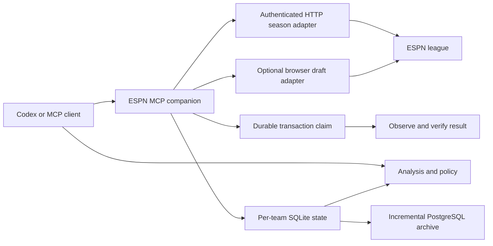

# Fantasy Football Manager

ESPN fantasy football team management for **Codex and other Model Context Protocol (MCP) clients**.
Season operations use authenticated HTTP without Chrome or Playwright.
Connect your league, sync its roster, and calculate a legal weekly lineup from current projections.
The same package provides a draft assistant with continuous Monte Carlo simulations and a server coordinator for multiple teams.

<!-- mcp-name: io.github.krmisystems/fantasy-football-manager -->

The **manager MCP server** provides 17 tools for analysis, policy, and league state.
The **ESPN MCP companion** provides 16 tools for live observations, controlled transactions, and continuous operation.
The **portfolio MCP** adds five tools for all configured teams, players, saved proposals, and lineup analysis.
HTTP season actions include lineups, free-agent additions, waiver claims, drops, and IR moves.
Draft support retains the existing browser adapter.

**Version 0.4.0 preview:** The reviewed v0.4.0 wheel is deployed privately and has completed a five-team HTTP observation sweep.
An explicitly authorized coverage repair also confirmed two automatic HTTP actions: a free-agent add/drop and a subsequent lineup exchange.
Version 0.3.3 assets retain their earlier behavior. See the release links below for the v0.4.0 preview.
Read [HTTP season acceptance](docs/HTTP_SEASON_ACCEPTANCE.md) for the current evidence and remaining live validation.

This independent project requires your ESPN account. A protected session file supplies HTTP authentication.
An optional Linux import reads only the two ESPN session cookies from an existing profile without starting a browser.

## Try a fictional lineup

Run this demo with Python 3.11 or later and [uv](https://docs.astral.sh/uv/).
It requires no ESPN account, Chrome session, or MCP client.

```sh
uvx --from fantasy-football-manager==0.4.0 fantasy-football-manager --demo
```

The command prints a fictional lineup report and exits without changing saved league state.
The verified demo returns `status: "ok"`, `live_actions: false`, and a projected improvement of **5.50 points**.
These values describe synthetic inputs, not a measured fantasy result.


Read the [developer showcase](https://github.com/krmisystems/fantasy-football-manager/blob/main/docs/SHOWCASE.md) for the design, verified trials, and contribution ideas.

## Open the team dashboard

The source checkout includes **Fieldroom**, a local dashboard for multiple managed teams.
Inspect rosters, source health, projections, action limits, and proposed changes in one workspace.
Optional approval controls submit exact saved HTTP season proposals through the existing transaction service.

```sh
uv sync --locked
uv run fantasy-football-dashboard --demo --enable-actions
```

Open `http://127.0.0.1:8765/`.
Demo approvals affect fictional in-memory records only. They make no ESPN requests.
The dashboard requires no Node.js runtime, ESPN account, or external UI service.
This dashboard is not included in the published v0.3.3 package.

Read the [dashboard setup and API guide](docs/PORTFOLIO.md) for actual team data and submission controls.
Use the [media UI integration prompt](docs/MEDIA_UI_HANDOFF.md) to connect an existing authenticated home-server interface.
Football is the only implemented sport. The portfolio envelope leaves room for future adapters.

## Start with a weekly lineup

HTTP roster reads have verified ownership and player locks across five team contexts.
One authorized Week 1 repair verified automatic free-agent acquisition and a subsequent lineup exchange through the deployed candidate.
Live waiver processing, IR moves, and scoring-week rollover remain Not Tested.

For the v0.4.0 source checkout:

```sh
uv sync --no-dev --extra session-import
```

1. Configure the protected session file with `FFM_ESPN_CREDENTIAL_FILE`.
2. Connect both MCP servers to the same per-team state directory.
3. Read the saved action modes with `get_manager_config`.
4. Call `espn_connect` with the league, team, season, `phase="season"`, `transport="http"`, and scoring week.
5. Call `espn_sync` to read current rosters, projections, locks, and pending transactions.
6. Call `recommend_lineup` to calculate a legal lineup.
7. Read `espn_get_status` before enabling the required action modes.

The [HTTP setup guide](docs/ESPN_AUTOMATION.md) explains credential permissions, supported imports, and renewal requirements.
No ESPN credential values are MCP tool arguments. HTTP mode does not start a browser.

The result includes the legal lineup and estimated projection change when the required inputs are complete.
Missing projections or lock evidence can prevent a recommendation or submission.
Selected-team lock evidence does not establish league-wide power rankings.



Read the [ESPN workflow and tool reference](https://github.com/krmisystems/fantasy-football-manager/blob/main/docs/ESPN_AUTOMATION.md) for configuration and submission steps.
Check the [versioned compatibility matrix](https://github.com/krmisystems/fantasy-football-manager/blob/main/docs/ESPN_COMPATIBILITY.md) for supported layouts, regression fixtures, and live evidence.

## Choose how actions run

| Mode | Behavior |
|---|---|
| Advisory | Calculate recommendations without submitting a live action. |
| Review | Prepare an exact proposal. Submit it after explicit confirmation. |
| Automatic | Submit supported actions within the saved per-action policy. No per-action confirmation is required. |
| Disabled | Block the selected action. |

Use `update_manager_config` to replace the full config with its current revision.
Read that config before changing one action mode. Strategy preferences do not grant execution permission.
For lineup changes with approval, use review mode and confirm each exact proposal.

For season automation, connect through HTTP and configure the required action modes and limits.
Then call `espn_start_automation`. Set `auto_rollover=true` to follow ESPN's verified current transaction period.
An unresolved submission keeps its original week until reconciliation completes.

HTTP mode submits a complete legal lineup transaction. Legacy browser mode still verifies one exchange at a time.
Acquisitions respect protected players, allowed drops, roster capacity, pending commitments, and league limits.
A named coverage repair requires explicit saved authorization when its improvement cannot be calculated. Unknown projections remain `null`.

Each live submission receives a durable claim before the HTTP request or draft click.
The service verifies the resulting ESPN state. An uncertain result blocks another submission until reconciliation.
A `pending_waiver` result identifies a queued claim. Only observed ownership can confirm an acquisition.
Use `espn_stop_automation` to pause new actions for that league's data directory.
It does not undo an action already submitted.

## Draft with continuous simulations

Install the `browser` extra for draft operations.
Connect with `phase="draft"`, then call `espn_sync` to verify complete history and the current pick.
Set the requested draft strategy, action mode, and limits before calling `espn_start_automation`.
Automatic submissions require the correct team on the clock and verified disabled ESPN Autopick.

The draft engine accounts for snake order, roster caps, starter completion, and five strategy preferences.
It recalculates after input changes and combines completed simulation batches for unchanged inputs.
Its estimates use a **two-pick horizon**, projected player values, and simulated opponent choices.
Availability estimates are conditional. They do not guarantee that a player survives to the next pick.
More trials do not correct stale inputs or projection errors. The model does not report championship odds.

The [fifth draft trial](https://github.com/krmisystems/fantasy-football-manager/blob/main/docs/FIFTH_DRAFT_ACCEPTANCE.md) completed with **13 manager-confirmed picks, two direct host-browser picks, and one unattributed selection**.
An opponent selection without a season projection blocked history normalization. The operator stopped the worker and completed the final two turns.
The host capture contains all 160 selections and matches the 132 picks previously stored by the server.
Installed v0.3.1 execution methods remained unchanged. This run required operator recovery and does not verify unattended completion.
Version 0.3.2 separates verified opponent identity from projected value. Its regression evidence is separate from this live run.

The earlier [fourth draft trial](https://github.com/krmisystems/fantasy-football-manager/blob/main/docs/FOURTH_DRAFT_ACCEPTANCE.md) verified all **160 league selections and 16 manager-confirmed picks**.
It recorded **zero ESPN Autopicks and zero host-browser `DRAFT` clicks**.
Installed v0.3.1 execution methods were unchanged. A private launcher handled collection and lifecycle.

One browser-control error occurred before the first authorization. A later check recovered before submission.
The run required no package patches, restart, or manual recovery.
A live Ravens D/ST selection succeeded. The record does not establish which autocomplete branch ran.

The [live draft trial](https://github.com/krmisystems/fantasy-football-manager/blob/main/docs/LIVE_DRAFT_ACCEPTANCE.md) completed a 16-player roster in a 10-team PPR snake draft.
It recorded **13 manager-confirmed picks and 3 ESPN Autopicks**.
Startup failures and an autocomplete timeout caused platform fallback selections.
The run required compatibility patches and manual recovery. It was not an unattended draft from start to finish.
Its runtime used installed v0.2.1 dependencies with changing working-tree patches.
Do not attribute that live result to an unchanged released wheel.

The [third draft trial](https://github.com/krmisystems/fantasy-football-manager/blob/main/docs/THIRD_DRAFT_ACCEPTANCE.md) also finished with 13 manager-confirmed picks and three platform fallbacks.
It exposed team-name whitespace and D/ST selector failures. Version 0.3.1 fixes both cases in isolated Chrome tests.
The browser handoff missed the final two turns. This trial also required operator recovery.

## Keep team management running

`espn_start_automation` runs inside the MCP process.
Use `espn_start_standalone_worker` for a local worker that continues after Codex closes while that computer remains available.

For operation without the client PC, install the [season coordinator on a server](https://github.com/krmisystems/fantasy-football-manager/blob/main/docs/SERVER.md).
The HTTP coordinator uses a protected server session file and visits configured teams serially.
It runs without the client PC, a Chrome process, or a display service.
Each team keeps a separate SQLite database, policy, scoring week, and pending claims.
A lease prevents simultaneous HTTP control of the same team through the same session directory.
Health separates process activity, observation freshness, analysis readiness, and action readiness.
The optional PostgreSQL archive exports bounded batches and commits checkpoints with the evidence.
Private backups preserve the operational databases and configuration.

The deployed v0.4.0 coordinator's first sweep returned fresh HTTP observations for all five teams.
Four teams had current analysis and required no lineup change. One team had incomplete tight-end coverage with an unknown projection.
Health correctly reported degraded analysis. That initial sweep submitted no live transaction and preserved existing team policies.

The user then authorized an exact coverage repair with temporary action limits.
Two unchanged automatic engine steps confirmed a free-agent add/drop, then a lineup exchange, through authenticated HTTP.
Both actions received ESPN `EXECUTED` receipts and matching roster observations. The previous starter remained on the bench.
Other roster players, starter assignments, and pending transactions stayed unchanged. The original policy was restored after execution.
Read [HTTP season acceptance](docs/HTTP_SEASON_ACCEPTANCE.md) for the deployment, package checks, and remaining live acceptance.

After the fifth draft, the v0.3.2 server verified fresh Week 1 observations, selected-team locks, and current lineup calculations for **five exact team contexts**.
The verified handoff recorded zero new lineup authorizations and zero unresolved authorized claims.
Those v0.3.2 observations did not verify live server lineup submission or an unattended season.
Read [server acceptance](https://github.com/krmisystems/fantasy-football-manager/blob/main/docs/SERVER_ACCEPTANCE.md) for restart, archive, and recovery evidence.
All three additional draft trials are complete, with their failures and execution sources recorded separately.
Five-team season outcomes and uninterrupted season operation remain [unverified](https://github.com/krmisystems/fantasy-football-manager/blob/main/docs/MULTI_TEAM_ACCEPTANCE.md).

## Install from PyPI

Version 0.4.0 adds HTTP season transactions, the portfolio MCP, and the Fieldroom dashboard.
The base HTTP installation needs no browser. Install the `browser` extra for live drafts.


Version 0.3.3 expands the descriptions, input schemas, and behavior annotations for all 30 MCP tools.
Read the [tool definition review](docs/TOOL_DEFINITION_QUALITY.md) for compatibility checks and external scoring status.
Version 0.3.2 preserves verified opponent draft history when a season projection is missing.
Version 0.3.1 fixed draft team-name whitespace and D/ST selectors.
Version 0.3.0 introduced server season scheduling, durable evidence, and a PostgreSQL archive.
Check the [PyPI project](https://pypi.org/project/fantasy-football-manager/) and [distribution status](https://github.com/krmisystems/fantasy-football-manager/blob/main/docs/DISCOVERY_ACCEPTANCE.md) for available releases.
The manager has an active [MCP Registry record](https://registry.modelcontextprotocol.io/v0.1/servers/io.github.krmisystems%2Ffantasy-football-manager/versions/latest).
Use Python 3.11 or later and [uv](https://docs.astral.sh/uv/).
The published v0.3.3 browser workflow also requires installed Google Chrome.

```sh
uv tool install fantasy-football-manager==0.4.0
fantasy-football-manager --help
fantasy-football-espn --help
fantasy-football-portfolio --help
fantasy-football-dashboard --help
```

## Install from source

For development, run these commands from the repository checkout:

```sh
uv sync --locked --dev
uv tool install --force .
fantasy-football-manager --help
fantasy-football-espn --help
fantasy-football-portfolio --help
fantasy-football-dashboard --help
```

## Connect the commands

Register both commands with Codex, or use the [Codex plugin instructions](https://github.com/krmisystems/fantasy-football-manager/blob/main/docs/PLUGIN_INSTALL.md):

```sh
codex mcp add fantasy-football-manager -- fantasy-football-manager
codex mcp add fantasy-football-espn -- fantasy-football-espn
```

Both commands must be on the MCP host's `PATH`. Restart the MCP connection after installation.
The plugin already registers both commands. Avoid duplicate direct registrations when using it.
The plugin contains workflow instructions and command registrations; it does not install the Python package.

Use the same `FFM_DATA_DIR` or `--data-dir` for both MCP servers that manage one league.
For v0.4.0 HTTP operation, configure `FFM_ESPN_CREDENTIAL_FILE` on the MCP host.
The base HTTP runtime requires neither Chrome nor Playwright.
For draft or legacy browser operation, install the `browser` extra and Google Chrome.
Use `FFM_BROWSER_DATA_DIR` to select a shared browser profile root across separate league databases.
Browser mode accepts an optional `cdp_url` for an explicit loopback browser debugging endpoint.
Keep profiles, credentials, databases, logs, and real league exports outside Git. Read the [privacy notes](https://github.com/krmisystems/fantasy-football-manager/blob/main/docs/PRIVACY.md).

Use the [v0.4.0 release page](https://github.com/krmisystems/fantasy-football-manager/releases/tag/v0.4.0) for the versioned
[wheel](https://github.com/krmisystems/fantasy-football-manager/releases/download/v0.4.0/fantasy_football_manager-0.4.0-py3-none-any.whl),
[plugin ZIP](https://github.com/krmisystems/fantasy-football-manager/releases/download/v0.4.0/fantasy-football-manager-0.4.0-plugin.zip), and checksums.
The [distribution acceptance record](https://github.com/krmisystems/fantasy-football-manager/blob/main/docs/DISCOVERY_ACCEPTANCE.md) tracks verified GitHub, PyPI, and MCP Registry publication separately.
Follow the [release instructions](https://github.com/krmisystems/fantasy-football-manager/blob/main/docs/RELEASING.md) for publisher setup. Earlier published assets remain unchanged.

## Scope and validation

| Area | Implemented scope | Limit |
|---|---|---|
| Draft assistant | Snake drafts, roster legality, strategy preferences, continuous Monte Carlo estimates | No auction support. Two-pick planning horizon. |
| Weekly analysis | Lineups, available-player comparisons, projected power rankings | Requires current projections, ownership, eligibility, and sufficient lock evidence. |
| ESPN HTTP season actions | Complete lineups, acquisitions, required drops, IR moves | Fresh authenticated evidence and saved policy are required. |
| ESPN draft actions | One verified pick per proposal | Requires the optional browser adapter. |
| Server team manager | HTTP team visits, optional period rollover, readiness, incremental archive, backups | Session renewal and unresolved transactions can require operator input. |
| Trade execution | Not implemented | Pending trades remain protected from conflicting automatic actions. |

The v0.4.0 local suite passed **1,048 tests with 22 skips**. A separate PostgreSQL run passed **92 archive tests**.
A fresh base installation passed actual STDIO checks for 17 manager tools and 16 ESPN tools without Playwright.
All 28 deployed Python files matched the reviewed wheel. Existing dependency versions and team policies remained unchanged.
One authorized repair subsequently verified automatic HTTP add/drop and lineup execution in a single Week 1 context.
Live waiver processing, IR moves, and scoring-week rollover remain Not Tested.
Read [HTTP season acceptance](docs/HTTP_SEASON_ACCEPTANCE.md) for the exact evidence boundary.

The v0.3.3 source passed **664 tests across the base and separate Chrome runs**, including **17 isolated Chrome cases**.
Two remaining skips required PostgreSQL configuration and Windows symlink permissions.
All seven [v0.3.3 source CI jobs](https://github.com/krmisystems/fantasy-football-manager/actions/runs/34314653579) passed, including Windows, Ubuntu, Chrome, and PostgreSQL checks.
These test counts are distinct from live account acceptance.
Live draft execution of an installed v0.3.3 wheel remains **Not Tested**.
See [validation status](https://github.com/krmisystems/fantasy-football-manager/blob/main/docs/VALIDATION.md), [server acceptance](https://github.com/krmisystems/fantasy-football-manager/blob/main/docs/SERVER_ACCEPTANCE.md), and the [compatibility matrix](https://github.com/krmisystems/fantasy-football-manager/blob/main/docs/ESPN_COMPATIBILITY.md).

For a synthetic demonstration, run `uv run fantasy-football-manager --demo`.
The CLI demo calculates an in-memory report. The manager's demo execution tools modify synthetic state only.
Use a separate state directory for demonstrations.

For development checks, run:

```sh
uv run pytest -q
uv run python scripts/validate_release.py
```

Browser and PostgreSQL cases require their explicit test settings. Use the [complete test commands](https://github.com/krmisystems/fantasy-football-manager/blob/main/docs/ESPN_COMPATIBILITY.md#repeat-the-checks).
Release packaging waits for the requested commit's Windows, Ubuntu, Chrome, and PostgreSQL gates.
See [architecture](https://github.com/krmisystems/fantasy-football-manager/blob/main/docs/ARCHITECTURE.md), [policy](https://github.com/krmisystems/fantasy-football-manager/blob/main/docs/POLICY.md), and [release instructions](https://github.com/krmisystems/fantasy-football-manager/blob/main/docs/RELEASING.md).
The [discovery measurement plan](https://github.com/krmisystems/fantasy-football-manager/blob/main/docs/DISCOVERY_MEASUREMENT.md) separates publication checks from observed discovery results.
The repository's [distribution check](docs/DISTRIBUTION_STATUS.md) reports GitHub and Glama state after updates and each day.
It records release gaps and unknown build evidence without publishing or requesting a rebuild.

The [Codex catalog package](docs/CATALOG_PLUGIN.md) uses validated root metadata and generated plugin files.

License: [MIT](https://github.com/krmisystems/fantasy-football-manager/blob/main/LICENSE). Copyright 2026 krmisystems.
