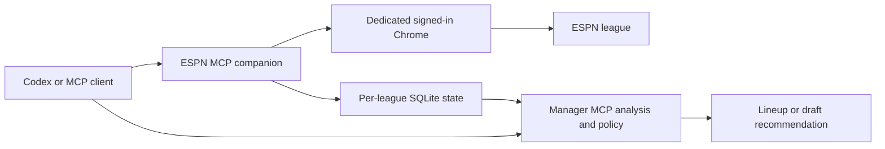

# Fantasy Football Manager

ESPN fantasy football draft and lineup tools for **Codex and other Model Context Protocol (MCP) clients**.
Connect your league, sync its roster, and calculate a legal weekly lineup from current projections.
The same package provides a draft assistant with continuous Monte Carlo simulations and a server coordinator for multiple teams.

<!-- mcp-name: io.github.krmisystems/fantasy-football-manager -->

The **manager MCP server** provides 17 tools for analysis, policy, and league state.
The **ESPN MCP companion** provides 13 tools for browser observation and controlled draft or lineup submissions.
ESPN requests use your signed-in browser session. This independent project does not supply an ESPN account or bypass sign-in.
Use browser sign-in without manually copying cookies between profiles.

## Start with a weekly lineup

Authenticated sign-in, roster sync, and advisory lineup analysis are verified workflows.
Start in advisory mode to inspect the recommendation before enabling live actions.

1. [Install and connect both MCP servers](#install-from-pypi).
2. Read the saved action modes with `get_manager_config`.
3. Keep `set_lineup` in advisory mode for the first check.
4. Call `espn_connect` with your league ID, team ID, season, `phase="season"`, and scoring `week`.
5. Sign in to ESPN in the dedicated Chrome window when required.
6. Call `espn_sync` to import the observed roster, projections, and player locks.
7. Call `recommend_lineup` on the manager to calculate the weekly lineup.
8. Read `espn_get_status` to check the context, observation age, and pending actions.

The result includes the legal lineup and estimated projection change when the required inputs are complete.
Missing projections or lock evidence can prevent a recommendation or submission.
Selected-team lock evidence does not establish league-wide power rankings.



Read the [ESPN workflow and tool reference](https://github.com/krmisystems/fantasy-football-manager/blob/main/docs/ESPN_AUTOMATION.md) for configuration and submission steps.
Check the [versioned compatibility matrix](https://github.com/krmisystems/fantasy-football-manager/blob/main/docs/ESPN_COMPATIBILITY.md) for supported layouts, regression fixtures, and live evidence.

## Choose how actions run

| Mode | Behavior |
|---|---|
| Advisory | Calculate recommendations without submitting a live action. |
| Review | Prepare an exact proposal. Submit it after explicit confirmation. |
| Automatic | Submit qualifying draft picks or lineup swaps within the saved policy. No per-action confirmation is required. |
| Disabled | Block the selected action. |

Use `update_manager_config` to replace the full config with its current revision.
Read that config before changing one action mode. Strategy preferences do not grant execution permission.
For lineup changes with approval, use review mode and confirm each exact proposal.

For season automation, call `espn_start_automation` after connecting to the explicit week and setting the authorized `set_lineup` mode.
Each intermediate lineup swap must meet the configured improvement limit.
Some optimized lineups require intermediate swaps that the limit blocks.
A confirmed swap does not mean the full optimized lineup was applied.

Each live submission receives a durable claim before the browser click.
The service verifies the resulting ESPN state. An uncertain result blocks another click until reconciliation.
Use `espn_stop_automation` to pause new actions for that league's data directory.
It does not undo an action already submitted.

## Draft with continuous simulations

Connect with `phase="draft"`, then call `espn_sync` to verify complete history and the current pick.
Set the requested draft strategy, action mode, and limits before calling `espn_start_automation`.
Automatic submissions require the correct team on the clock and verified disabled ESPN Autopick.

The draft engine accounts for snake order, roster caps, starter completion, and five strategy preferences.
It recalculates after input changes and combines completed simulation batches for unchanged inputs.
Its estimates use a **two-pick horizon**, projected player values, and simulated opponent choices.
Availability estimates are conditional. They do not guarantee that a player survives to the next pick.
More trials do not correct stale inputs or projection errors. The model does not report championship odds.

The [live draft trial](https://github.com/krmisystems/fantasy-football-manager/blob/main/docs/LIVE_DRAFT_ACCEPTANCE.md) completed a 16-player roster in a 10-team PPR snake draft.
It recorded **13 manager-confirmed picks and 3 ESPN Autopicks**.
Startup failures and an autocomplete timeout caused platform fallback selections.
The run required compatibility patches and manual recovery. It was not an unattended draft from start to finish.
Its runtime used installed v0.2.1 dependencies with changing working-tree patches.
Do not attribute that live result to an unchanged released wheel.

## Keep team management running

`espn_start_automation` runs inside the MCP process.
Use `espn_start_standalone_worker` for a local worker that continues after Codex closes while that computer remains available.

For operation without the client PC, install the [season coordinator on a server](https://github.com/krmisystems/fantasy-football-manager/blob/main/docs/SERVER.md).
The server retains its own signed-in Chrome profile and visits configured teams serially.
Each team keeps a separate SQLite database, policy, explicit week, and pending claims.
One shared profile lease prevents simultaneous browser control.
The optional PostgreSQL archive preserves labeled evidence. Private backups preserve the operational databases and configuration.

The development server passed **two-team observation and analysis checks with zero live server lineup swaps**.
No qualifying swap was needed. This does not verify live server lineup submission or an unattended season.
Read [server acceptance](https://github.com/krmisystems/fantasy-football-manager/blob/main/docs/SERVER_ACCEPTANCE.md) for restart, archive, and recovery evidence.
Three additional draft trials and a five-team season trial are [planned](https://github.com/krmisystems/fantasy-football-manager/blob/main/docs/MULTI_TEAM_ACCEPTANCE.md).

## Install from PyPI

Version 0.3.0 adds server season scheduling, durable evidence, and a PostgreSQL archive.
The [0.3.0 package is published on PyPI](https://pypi.org/project/fantasy-football-manager/0.3.0/).
Use Python 3.11 or later, [uv](https://docs.astral.sh/uv/), and installed Google Chrome.

```sh
uv tool install fantasy-football-manager==0.3.0
fantasy-football-manager --help
fantasy-football-espn --help
```

## Install from source

For development, run these commands from the repository checkout:

```sh
uv sync --locked --dev
uv tool install --force .
fantasy-football-manager --help
fantasy-football-espn --help
```

## Connect the commands

Register both commands with Codex, or use the [Codex plugin instructions](https://github.com/krmisystems/fantasy-football-manager/blob/main/docs/PLUGIN_INSTALL.md):

```sh
codex mcp add fantasy-football-manager -- fantasy-football-manager
codex mcp add fantasy-football-espn -- fantasy-football-espn
```

Both commands must be on the MCP host's `PATH`. Restart the MCP connection after installation.
The plugin already registers both commands. Avoid duplicate direct registrations when using it.
The plugin contains workflow instructions and command registrations; it does not install the Python package.

Use the same `FFM_DATA_DIR` or `--data-dir` for both MCP servers that manage one league.
Use `FFM_BROWSER_DATA_DIR` to select a shared browser profile root across separate league databases.
The package includes Playwright and uses installed Chrome.
An optional `cdp_url` can connect to an explicit loopback browser debugging endpoint.
Keep profiles, credentials, databases, logs, and real league exports outside Git. Read the [privacy notes](https://github.com/krmisystems/fantasy-football-manager/blob/main/docs/PRIVACY.md).

The [v0.3.0 release page](https://github.com/krmisystems/fantasy-football-manager/releases/tag/v0.3.0) identifies the versioned
[wheel](https://github.com/krmisystems/fantasy-football-manager/releases/download/v0.3.0/fantasy_football_manager-0.3.0-py3-none-any.whl),
[plugin ZIP](https://github.com/krmisystems/fantasy-football-manager/releases/download/v0.3.0/fantasy-football-manager-0.3.0-plugin.zip), and checksums.
The [distribution acceptance record](https://github.com/krmisystems/fantasy-football-manager/blob/main/docs/DISCOVERY_ACCEPTANCE.md) tracks verified GitHub, PyPI, and MCP Registry publication separately.
Follow the [release instructions](https://github.com/krmisystems/fantasy-football-manager/blob/main/docs/RELEASING.md) for publisher setup. Earlier published assets remain unchanged.

## Scope and validation

| Area | Implemented scope | Limit |
|---|---|---|
| Draft assistant | Snake drafts, roster legality, strategy preferences, continuous Monte Carlo estimates | No auction support. Two-pick planning horizon. |
| Weekly analysis | Lineups, available-player comparisons, projected power rankings | Requires current projections, ownership, eligibility, and sufficient lock evidence. |
| ESPN live actions | Draft picks and one lineup swap per verified proposal | Browser compatibility and current authorization are required. |
| Server team manager | Serial team visits, graceful stop, health, durable evidence, PostgreSQL archive, backups | Explicit weeks. Shared browser control is serial. |
| Planned season actions | Live waivers, free-agent additions, drops, trades, and automatic week rollover | These execution adapters are not implemented. |

The final local validation passed **608 tests on Windows**, including **15 isolated Chrome cases**.
The two skips were PostgreSQL configuration and Windows symlink permissions.
Separate Linux checks passed **23 archive tests** with PostgreSQL and **28 discovery collector tests**.
These test counts are distinct from live account acceptance.
See [validation status](https://github.com/krmisystems/fantasy-football-manager/blob/main/docs/VALIDATION.md), [server acceptance](https://github.com/krmisystems/fantasy-football-manager/blob/main/docs/SERVER_ACCEPTANCE.md), and the [compatibility matrix](https://github.com/krmisystems/fantasy-football-manager/blob/main/docs/ESPN_COMPATIBILITY.md).

For a synthetic demonstration, run `uv run fantasy-football-manager --demo`.
The CLI demo calculates an in-memory report. The manager's demo execution tools modify synthetic state only.
Use a separate state directory for demonstrations.

For development checks, run:

```sh
uv run pytest -q
uv run python scripts/validate_release.py
```

Browser and PostgreSQL cases require their explicit test settings. Use the [complete test commands](https://github.com/krmisystems/fantasy-football-manager/blob/main/docs/ESPN_COMPATIBILITY.md#repeat-the-checks).
Release packaging waits for the requested commit's Windows, Ubuntu, Chrome, and PostgreSQL gates.
See [architecture](https://github.com/krmisystems/fantasy-football-manager/blob/main/docs/ARCHITECTURE.md), [policy](https://github.com/krmisystems/fantasy-football-manager/blob/main/docs/POLICY.md), and [release instructions](https://github.com/krmisystems/fantasy-football-manager/blob/main/docs/RELEASING.md).
The [discovery measurement plan](https://github.com/krmisystems/fantasy-football-manager/blob/main/docs/DISCOVERY_MEASUREMENT.md) separates publication checks from observed discovery results.

License: [MIT](https://github.com/krmisystems/fantasy-football-manager/blob/main/LICENSE). Copyright 2026 krmisystems.
