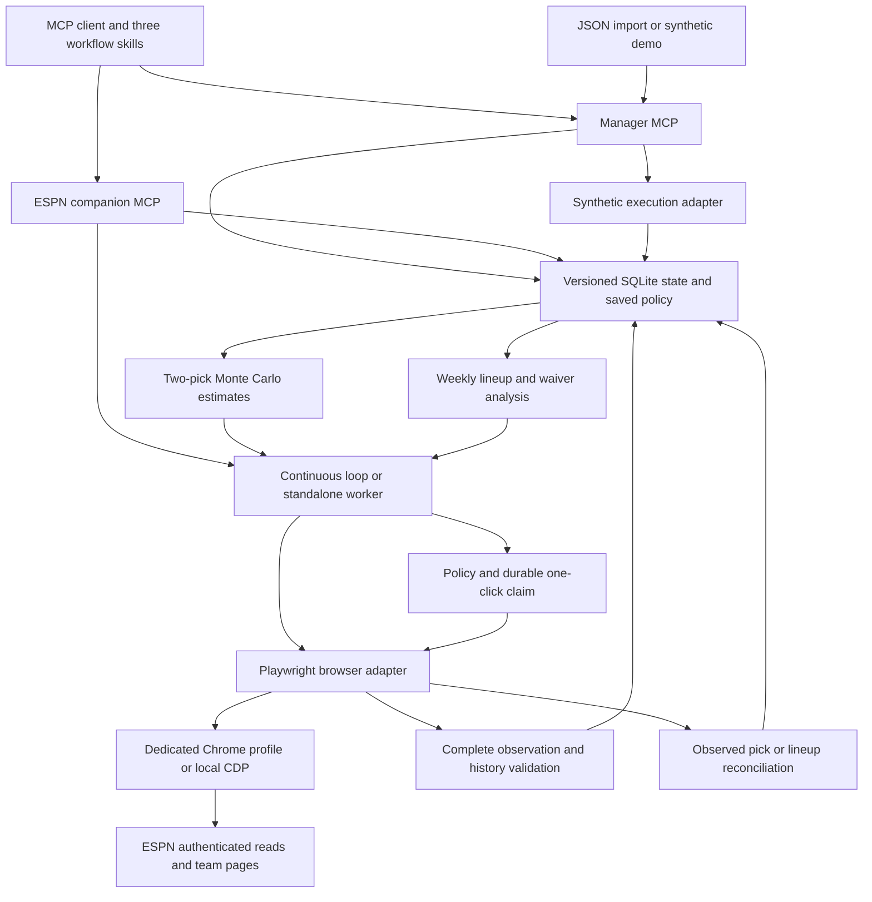
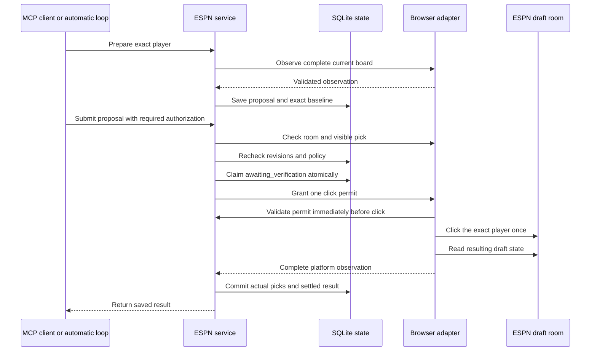
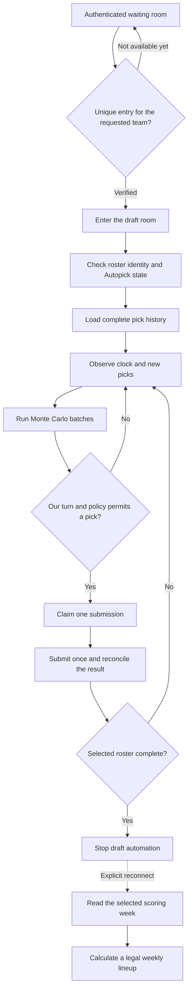

# Architecture

Two local STDIO servers share policy and versioned SQLite state.
The manager provides calculations and synthetic execution.
The ESPN companion provides browser observations, live draft submissions, and verified weekly lineup swaps.
An optional Linux coordinator visits season contexts in sequence with one server browser.
A separate PostgreSQL archive retains labeled evidence without remote database calls during draft actions.
See [server architecture and operation](SERVER.md).

## State and estimates

A snapshot identifies its league, team, season, week, source, and observation time.
Validation checks unique players, ownership, draft order, roster rules, and browser identity.
Changed decision inputs receive a revision. Timestamp-only refreshes retain that revision.
Configuration changes receive a separate revision.
Both servers must share a data directory to coordinate the same league context.

The draft model compares the next two selections.
Strategy weights change preferences without changing supplied projections or hard roster requirements.
Matching batches combine score sums and conditional availability counts.
Changed inputs reset the aggregate. Stale state and failed observations suppress outdated recommendations.
More trials cannot repair a wrong projection or missing pick.

Weekly calculations require weekly projections and preserve locked assignments.
Lock evidence records `league` or `selected_team` scope. Own-team controls do not establish locks for other teams.
League-wide power rankings require league-wide lock coverage.
An ownership change on any team invalidates the ESPN player-response cache.
Season totals are not divided into invented weekly forecasts.
Floor and upside objectives sum supplied player bounds. Those sums are not team outcome percentiles.

## Live draft claim and verification

Review mode requires confirmation of the exact proposal.
Automatic mode uses saved authorization and limits.
Neither mode bypasses stale data, changed configuration, caps, or unresolved claims.
A timeout leaves the claim awaiting verification. Repeated submission cannot grant another click.
Missing expected picks do not create phantom roster entries.

The manager's separate execution tools remain restricted to synthetic state.
Season mode uses a separate durable lineup proposal and verifies each swap.
It checks the exact incoming player and destination occupant before the confirmation click.
Reconciliation compares occupant sets within equivalent slot groups. RB slot order alone does not change a lineup.
Each swap must meet the configured improvement limit. A target can require intermediate moves that fail that limit.
One confirmed swap does not establish that the full optimized lineup was applied.
Live waivers, acquisitions, drops, and trades have no adapter in this version.

## Runtime lifetime

The ordinary ESPN loop belongs to its MCP process.
A standalone worker uses the saved connection and policy in a separate process.
It can continue after Codex closes. Draft mode stops when the selected roster is complete.
Season mode continues for the explicit connected week. Automatic week rollover remains planned.
A shared pause flag blocks new actions across workers using the same data directory.
The profile lease prevents simultaneous ownership of that profile.

`FFM_DATA_DIR` selects the league database. `FFM_BROWSER_DATA_DIR` can select a separate, shared browser profile root.
Separate league databases keep their own policy, proposals, and history.
Only one controller can use a shared browser profile at a time.

A launch identifier connects a standalone worker request to that worker's heartbeat.
The parent verifies the identifier and heartbeat time before it reports startup success.
The worker PID can differ from the Windows launcher PID.
Per-launch status preserves a startup failure without replacing another worker's status.

Saved state and proposals survive normal restarts through SQLite.
The worker is not an operating-system service and has no automatic reboot recovery.
See the [fourth draft record](FOURTH_DRAFT_ACCEPTANCE.md) for installed v0.3.1 submissions with a private orchestration launcher.
The earlier [live draft record](LIVE_DRAFT_ACCEPTANCE.md) retains its development-runtime limits and recovery failures.
Live lineup submission still needs a separate acceptance check.

## Draft entry and season handoff

The draft worker stops when the selected roster is complete.
A separate observation can verify the remaining league picks.
Season operation requires an explicit phase and scoring week. The draft worker does not start season automation automatically.
