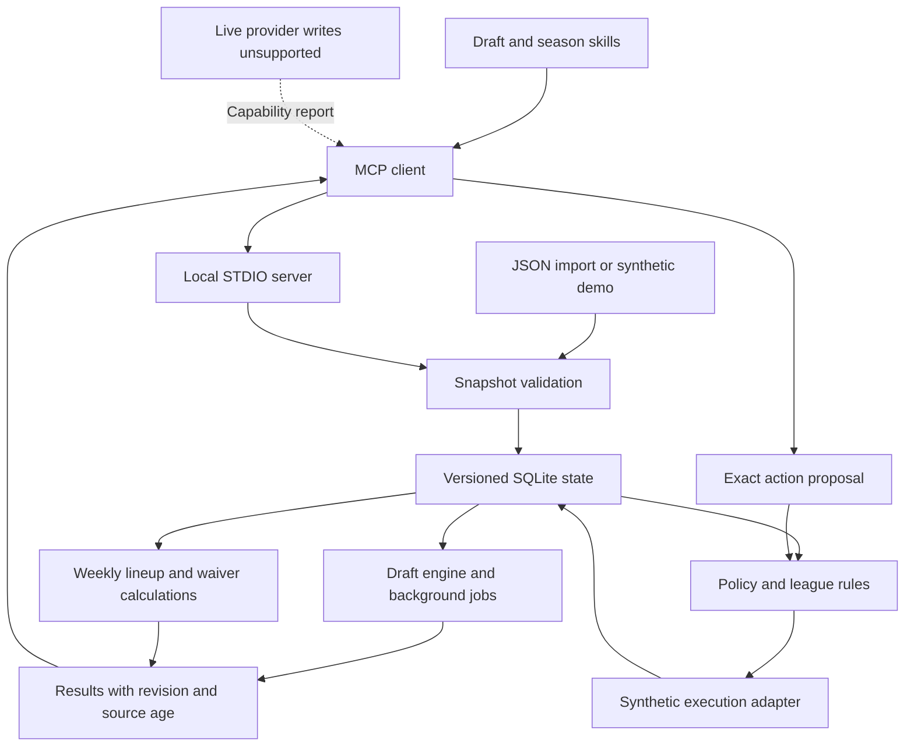
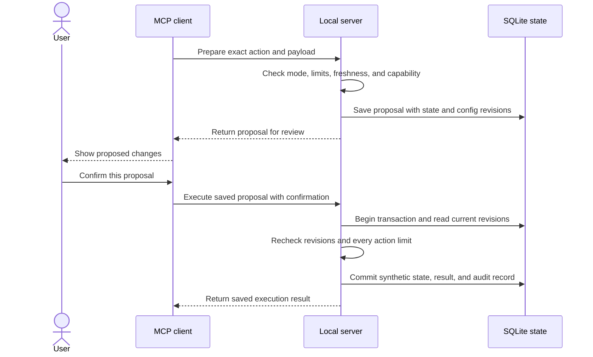

# Architecture

The service separates data validation, calculations, execution policy, and local state.
MCP exposes bounded operations. The server owns draft calculation jobs.

## State and calculations

An imported snapshot identifies its league, team, season, week, and observation source.
Validation checks player identities, ownership, draft order, roster rules, and completeness.
The store gives accepted state a revision.
Results remain tied to the inputs that produced them.

Draft calculations compare the next two selections.
Strategy preferences affect candidate ranking. They do not change legal roster requirements.
Weekly calculations use weekly projections and preserve locked assignments.
Missing inputs remain visible. Season projections are not divided into invented weekly forecasts.
Floor and upside objectives sum the supplied player bounds. Those sums are not team outcome percentiles.
Power rankings compare expected weekly points after each team uses the selected lineup strategy.

## Actions

An action proposal identifies its exact operation and relevant state revision.
Policy checks combine action mode, supported capability, user limits, and league rules.
An add/drop transaction must pass every included action policy.
Version 0.1 executes changes only against synthetic state.
No selection in the configuration can enable live ESPN, Sleeper, or trade execution.

This sequence shows review mode. Automatic mode omits confirmation but retains every execution check.
A repeated execution request returns the saved result.

## Runtime limits

The local server runs while its MCP host keeps the process active.
Stored state can survive a server restart. Active calculations require a running server.
Process supervision and a hosted HTTP service are separate deployment work.
Repeated trials reduce sampling noise. They cannot repair stale observations or incorrect projections.
