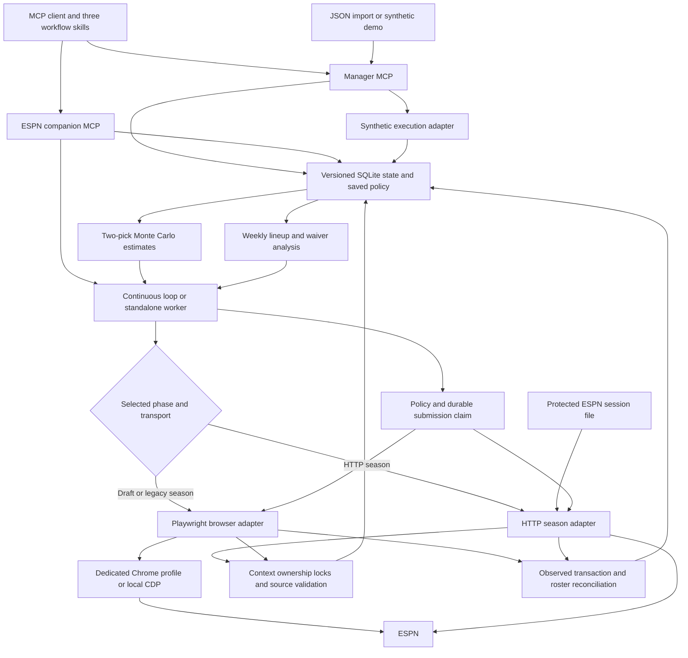
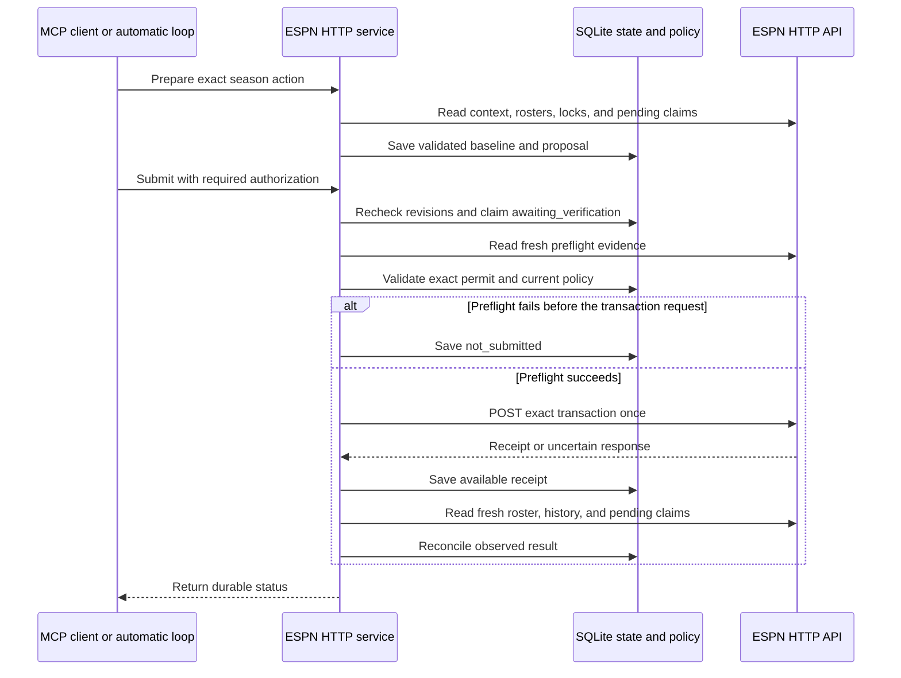
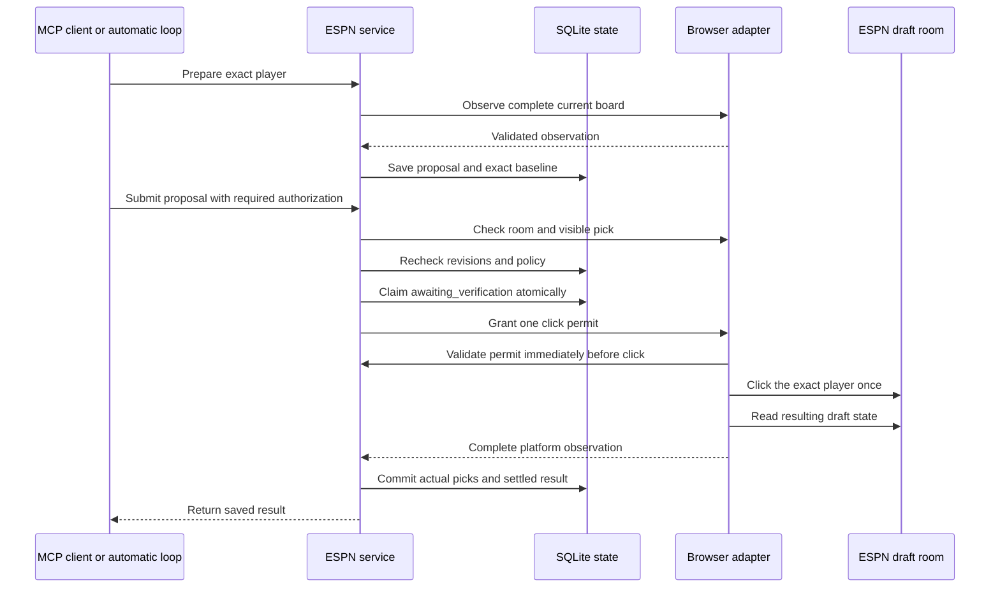
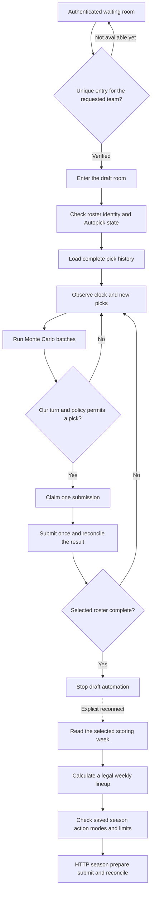

# Architecture

Two local STDIO servers share policy and versioned SQLite state.
The manager provides calculations and synthetic execution.
The ESPN companion selects an HTTP season adapter or the existing browser draft adapter.
The v0.4.0 release candidate adds HTTP season operation. It is not yet a published release.
An optional Linux coordinator visits configured season contexts in sequence.
A separate PostgreSQL archive retains labeled evidence without remote database calls during draft actions.
See [server architecture and operation](SERVER.md).

## State and estimates

A snapshot identifies its league, team, season, week, source, and observation time.
Validation checks unique players, ownership, draft order, roster rules, and the selected source context.
Changed decision inputs receive a revision. Timestamp-only refreshes retain that revision.
Configuration changes receive a separate revision.
Both servers must share a data directory to coordinate the same league context.

The draft model compares the next two selections.
Strategy weights change preferences without changing supplied projections or hard roster requirements.
Matching batches combine score sums and conditional availability counts.
Changed inputs reset the aggregate. Stale state and failed observations suppress outdated recommendations.
More trials cannot repair a wrong projection or missing pick.

Weekly calculations require weekly projections and preserve locked assignments.
Lock evidence records `league` or `selected_team` scope. Selected-team evidence does not establish locks for other teams.
League-wide power rankings require league-wide lock coverage.
The browser adapter invalidates its player-response cache when any team's ownership changes.
The HTTP adapter compares the complete roster response with a separate targeted roster response.
Conflicting ownership or lineup assignments reject that observation.
The targeted response supplies own-team locks. Generic pool flags cannot override them.
Season totals are not divided into invented weekly forecasts.
Floor and upside objectives sum supplied player bounds. Those sums are not team outcome percentiles.

## HTTP season transaction and verification

The HTTP runtime requires neither a browser process nor the Playwright library.
Its protected session file contains only ESPN `SWID` and `espn_s2` credentials.
An optional Linux importer reads those cookies from a supported Chromium database without starting Chromium.
The HTTP client restricts destinations, rejects redirects, and does not retry transaction requests.
See [privacy behavior](PRIVACY.md) and the [source compatibility report](ESPN_HTTP_COMPATIBILITY.md).

An HTTP lineup transaction can contain several positional changes.
An acquisition can include its permitted drop in the same transaction.
Starting the acquired player requires a later proposal after ownership is confirmed.
IR moves require explicit injury eligibility and capacity. Activation requires an active roster vacancy.
Trade execution remains unavailable.

Named coverage repairs supplement ordinary projected improvement checks.
Saved player lists restrict the starter and, when configured, replacement candidates.
This exception preserves unknown projections and does not bypass locks, drop permission, budgets, or roster rules.
See [policy behavior](POLICY.md) for exact requirements.

A durable claim prevents another POST for the same proposal across retries or process restarts.
`not_submitted` means that preflight failed before the transaction request began.
An uncertain response remains `awaiting_verification` until observed evidence establishes its result.
A matching pending waiver produces `pending_waiver`. Ownership remains unconfirmed until the roster contains the acquired player.
Matching terminal receipts require an unchanged baseline for rejection or cancellation. Conflicting roster changes produce `conflict`.

[HTTP service tests](../tests/test_espn_http_service.py) exercise these paths with fictional HTTP state.
[Normalizer tests](../tests/test_espn_http_data.py) cover request context, ownership conflicts, targeted locks, pending claims, and missing projections.
These tests establish implementation behavior, not live write acceptance.

## Live draft claim and verification

Review mode requires confirmation of the exact proposal.
Automatic mode uses saved authorization and limits.
Neither mode bypasses stale data, changed configuration, caps, or unresolved claims.
A timeout leaves the claim awaiting verification. Repeated submission cannot grant another click.
Missing expected picks do not create phantom roster entries.

The manager's separate execution tools remain restricted to synthetic state.
The legacy browser season adapter uses a separate durable lineup proposal and verifies each swap.
It checks the exact incoming player and destination occupant before the confirmation click.
Reconciliation compares occupant sets within equivalent slot groups. RB slot order alone does not change a lineup.
Each swap must meet the configured improvement limit. A target can require intermediate moves that fail that limit.
One confirmed swap does not establish that the full optimized lineup was applied.
This browser adapter does not execute HTTP acquisitions or IR moves.

## Runtime lifetime

The ordinary ESPN loop belongs to its MCP process.
A standalone worker uses the saved connection and policy in a separate process.
It can continue after Codex closes. Draft mode stops when the selected roster is complete.
Season mode continues for the explicit connected week unless HTTP `auto_rollover=true` is enabled.
HTTP rollover reads ESPN's current transaction period before changing the saved week.
Unresolved submissions and pending waivers retain their original week. Backward or unverified periods stop rollover.
A shared pause flag blocks new actions across workers using the same data directory.
An in-flight bounded operation can finish after a pause request.

`FFM_DATA_DIR` selects the league database. `FFM_BROWSER_DATA_DIR` can select a separate, shared browser profile root.
Separate league databases keep their own policy, proposals, and history.
Only one controller can use a shared browser profile at a time.
HTTP services use a separate lease for each league and team in the shared credential directory.
The lease prevents simultaneous control across different manager databases that use that directory.
Different teams can connect independently. Unrelated copies of credentials do not share a lease.
Connection close and failed connection cleanup release the HTTP lease.

A launch identifier connects a standalone worker request to that worker's heartbeat.
The parent verifies the identifier and heartbeat time before it reports startup success.
The worker PID can differ from the Windows launcher PID.
Per-launch status preserves a startup failure without replacing another worker's status.

Saved state and proposals survive normal restarts through SQLite.
The worker is not an operating-system service and has no automatic reboot recovery.
See the [fourth draft record](FOURTH_DRAFT_ACCEPTANCE.md) for installed v0.3.1 submissions with a private orchestration launcher.
The earlier [live draft record](LIVE_DRAFT_ACCEPTANCE.md) retains its development-runtime limits and recovery failures.
The v0.3.3 release and draft records remain historical evidence for the browser workflow.
The v0.4.0 HTTP candidate completed one authorized free-agent add/drop and a subsequent lineup exchange on 2026-09-10 UTC.
Both transactions had matching ESPN receipts and fresh roster observations. The previous policy was restored after verification.
Read [HTTP season acceptance](HTTP_SEASON_ACCEPTANCE.md) for this result and its limits.
Live waiver processing, IR moves, scoring-week rollover, and an unattended season remain **Not Tested**.

## Draft entry and season handoff

The draft worker stops when the selected roster is complete.
A separate observation can verify the remaining league picks.
Season operation requires an explicit phase and scoring week. The draft worker does not start season automation automatically.
