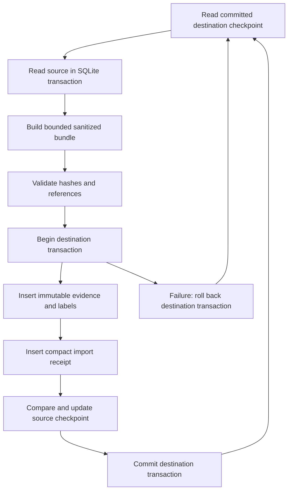

# Incremental evidence archive

The archive now commits bounded export batches and durable source checkpoints in one destination transaction.
New incremental receipts contain counts and content digests. They do not contain cumulative lists of record identifiers.
An unchanged source produces no new receipt.

**Verified:** All 77 archive tests passed with PostgreSQL 16.15 and SQLite under the application service role in an isolated test database.
They cover export, import, restart, rollback, replay, source changes, receipt compaction, and exact legacy evidence coverage.
**Not Tested:** Production migration, production compaction, and sustained collection on the server.
The PostgreSQL tests require an explicit isolated test database. A skipped local test does not verify PostgreSQL behavior.

## Verified full-data rehearsal

An isolated PostgreSQL restore passed the complete maintenance workflow on 2026-09-10 UTC.
The backup contained the archive database, five SQLite sources, and the private archive manifest.
All seven backup-file checksums passed. Every source SQLite backup also passed its integrity check.
Production data and installed application files remained unchanged.

| Check | Verified result |
|---|---|
| Legacy receipts compacted | 1,423, with unchanged import identities and times |
| Immutable evidence | Exact unchanged hashes for 17 runs, 91,622 records, and 178,543 labels |
| Manifest text | 12,654,563,617 bytes before; 2,505,565 bytes after |
| Imports table, including storage and indexes | 11,497,848,832 bytes before; 2,465,792 bytes after isolated reclamation |
| Database size | 12,127,910,935 bytes before; 632,699,927 bytes after isolated reclamation |
| Real historical bundle replay | 1,181 records and 3,863 labels verified; zero insertions after compaction |
| Incremental bootstrap | 20 batches; all 54,767 frozen audit/outbox rows covered across five sources |
| Bootstrap additions | 157 records and 20 compact receipts; no new runs or labels |
| Final idle synchronization | Zero records, labels, checkpoints, or receipts added |
| Source-backup preservation | All five SQLite file hashes remained unchanged |

The backup captures each database independently. It is not a single transaction across PostgreSQL and all SQLite sources.
The bootstrap therefore verifies each frozen source's actual row keys against the restored archive.

Measured durations were 339 seconds for backup, 102 seconds for restore, and 566 seconds for verified compaction.
Isolated imports-only reclamation took 1.5 seconds. The five-source bootstrap took 136 seconds.
These measurements describe the rehearsal. They do not guarantee production timing.

## Commands and compatibility

The input manifest remains schema version `1`.
Existing `source_id`, `run_id`, run metadata, and context values retain their meaning.
The default `sync` command now exports schema version `2` bundles.
The default batch size is `500` source rows per event stream, proposal table, or event dataset.
The permitted range is `1` through `10000`.

Use the existing private manifest and destination settings:

```sh
fantasy-football-archive sync --manifest "$PRIVATE_ARCHIVE_MANIFEST" --dsn "$PRIVATE_ARCHIVE_DSN" --batch-size 500
```

One invocation commits one batch.
The result reports `has_more` when an observed backlog remains.
Use `--drain` for an initial backfill or a controlled backlog drain:

```sh
fantasy-football-archive sync --manifest "$PRIVATE_ARCHIVE_MANIFEST" --dsn "$PRIVATE_ARCHIVE_DSN" --batch-size 500 --drain
```

`--interval` repeats synchronization after each configured interval.
`--drain` commits successive backlog batches before that interval.
Continuous source writes can extend a drain. A scheduled bounded invocation does not have that behavior.

For a separate export and import, read checkpoints from the destination during export:

```sh
fantasy-football-archive export --incremental --manifest "$PRIVATE_ARCHIVE_MANIFEST" --dsn "$PRIVATE_ARCHIVE_DSN" --output "$PRIVATE_BUNDLE"
fantasy-football-archive import --bundle "$PRIVATE_BUNDLE" --dsn "$PRIVATE_ARCHIVE_DSN"
```

Export does not create or advance destination checkpoints.
Import advances them only after all evidence and labels pass validation.
A stale bundle requires a new export. A previously committed bundle remains safe to replay after later commits.

Legacy schema version `1` bundles remain readable and importable.
`export` without `--incremental` retains the full-history format.
`sync --legacy-full` explicitly selects the previous synchronization behavior.
That option also retains cumulative manifests and their storage cost.
The upgrade does not rewrite existing records, labels, runs, or import manifests.

## Transaction and storage contract



| Storage | Contract |
|---|---|
| `archive_records`, `archive_labels`, `archive_runs` | Existing immutable evidence and provenance. Their identity rules remain unchanged. |
| `archive_imports` | One schema-v2 count/digest receipt per committed changed batch. Receipt length does not depend on accumulated source history. |
| `archive_source_checkpoints` | One current checkpoint per run. It stores revisions, source boundaries, dataset progress, and sequence. |
| `archive_source_objects` | One current fingerprint per proposal. A changed fingerprint exports another immutable proposal observation. |

The checkpoint sequence identifies archive progress. It does not identify the runtime that performed an action.
The exporter retains labeled observation, authorization, browser return, and reconciliation evidence separately.
Neither a checkpoint nor a successful import establishes who caused a pick.

HTTP observations retain verified ownership, transaction state, player eligibility, and lock evidence.
They retain narrow pending/recent transaction fields and coverage-repair configuration.
The exporter removes HTTP roster URLs, account fields, headers, and free-form server messages.
Model validation reconstructs an exact scoped HTTP URL only in memory for previously redacted evidence.
Missing optional historical fields remain absent. New model defaults do not change old snapshot hashes.

The importer checks the previous checkpoint digest before writes.
It also compares the checkpoint during its final update.
A competing import cannot silently overwrite newer progress.
The importer requires its own transaction. It rejects an existing outer transaction.

Only the next event rows enter each SQLite export batch.
The exporter verifies committed row counts and boundary hashes before it reads new rows.
It scans mutable proposal tables to detect changed results and deleted proposals.
JSONL export verifies the committed prefix and keeps only the next batch in memory.
The `audit_json` format loads its JSON array into memory. Use JSONL for large event files.
Snapshot datasets are complete structured snapshots, rather than row streams.

The batch limit applies to source rows, rather than bytes or derived evidence records.
A snapshot row can produce many draft-pick records and labels.
Multiple selected sources and datasets each contribute their own bounded batches.
Receipt size stays bounded even when a selected row contains a large snapshot.

## Source identity and reset handling

Checkpoints bind to source identity, run metadata, context, selected dataset identifiers, dataset formats, and a logical source epoch.
The optional `sources[].source_epoch` defaults to the external `run_id`.
Private source paths do not enter bundles or checkpoints.
Relocating an unchanged source file therefore does not change its logical identity.

The exporter rejects these conditions:

- A snapshot or configuration revision decreases.
- Data changes without its corresponding revision change.
- A committed event row disappears, or a committed boundary row changes.
- An event table or previously observed proposal disappears.
- An event dataset becomes shorter, or its committed prefix changes.
- Source selection, context, epoch, or immutable run metadata changes under an existing checkpoint.

After an intentional source reset, use a new `source_id` and `run_id`.
Preserve the previous archive and its checkpoint.
For accidental rollback, restore the original source before synchronization resumes.
Do not edit or delete a checkpoint to suppress a continuity failure.

**Detection limits:** Manager databases currently contain no persistent database-incarnation identifier.
The archive cannot distinguish an identical clone from its original database.
SQLite boundary checks do not detect an interior row rewrite that preserves row count and both committed boundary rows.
They detect interior deletion through the committed row count.
These checks protect normal append-only collection and common resets. They are not a complete historical tamper audit.
JSONL and JSON event datasets receive full committed-prefix verification on each export.

Operator labels can reference a pick already committed under the same source and run.
Complete the initial backfill before adding labels for picks absent from the current batch.
Removing a label from the input manifest does not delete its historical archive evidence.

## Existing archive transition

The first incremental synchronization has no checkpoint for an existing legacy run.
It reads the source in batches and imports the existing content identities again.
Duplicate evidence remains unchanged. Each successful batch creates its first durable progress checkpoint.
Subsequent invocations start after those committed source boundaries.

Keep existing immutable run metadata during this transition.
Changing its label or claimed runtime version does not repair historical provenance.
The legacy import test verifies that bootstrap adds checkpoints without duplicate evidence or changed historical receipts.

Existing large manifests remain in the database after this upgrade.
The new writer stops cumulative manifest growth. It does not reclaim storage already occupied by old manifests.

## Manifest compaction and recovery

The `compact-receipts` command verifies every legacy manifest entry against stored evidence before it replaces that manifest.
Its default mode only verifies the proposed operation:

```sh
fantasy-football-archive compact-receipts --dsn "$PRIVATE_ARCHIVE_DSN"
```

After a verified backup and isolated restore rehearsal, use `--apply` to replace the verified manifests:

```sh
fantasy-football-archive compact-receipts --dsn "$PRIVATE_ARCHIVE_DSN" --apply
```

Pause archive writers for the maintenance window.
The command commits all receipt replacements in one transaction.
An invalid manifest, changed evidence row, or failed commit rolls back every replacement.
It streams one stored manifest at a time and retains an evidence-hash index in memory.
The index grows with unique evidence, rather than cumulative receipt membership.

Compact legacy receipts preserve the original manifest hash, ordered membership digests, counts, and run/source provenance.
They preserve each import identity and import time.
Membership digests are cryptographic commitments. They cannot reconstruct an original membership list.
Exact historical membership reconstruction requires the original bundle or the retained backup.
Legacy bundle replay verifies the equivalent compact receipt before it accepts an existing import.
The archive keeps records, labels, run metadata, checkpoints, and proposal fingerprints unchanged.
The command reports exact table hashes before and after replacement.

**Not Tested:** Production compaction and production space reclamation.

Production maintenance requires all of these conditions:

- The reviewed package passes the archive tests, including PostgreSQL tests under the service role.
- Every archive writer is stopped, including timers, services, manual sync processes, and queued maintenance jobs.
- A fresh backup completes after the writers stop, and every backup-file checksum passes.
- An isolated restore passes legacy replay, exact evidence hashes, and incremental source-coverage checks.
- The production verification report matches its paused-writer evidence and import-identity baseline.
- The operator preserves the final backup and reports before application and imports-only space reclamation.

Keep archive writers stopped until post-maintenance verification finishes.
Start the controlled checkpoint bootstrap only after receipt replacement and storage checks pass.
Treat bootstrap and resumed synchronization as new production writes.

Use this acceptance sequence before production compaction:

1. Pause the archive writer.
2. Record the installed archive version, selected run identities, row counts, and table sizes.
3. Create a complete backup with `deployment/backup.py` in a new private backup directory.
4. Verify its completion marker and every recorded file checksum.
5. Confirm sufficient measured storage for both the backup and a complete isolated restore.
6. Restore the PostgreSQL dump into an isolated database.
7. Restore each selected SQLite backup into the isolated rehearsal directory.
8. Verify the restored tables against the backup inventory before the rehearsal.
9. Perform the incremental bootstrap against the restored sources and isolated destination.
10. Compare all evidence identities and label identities against the pre-bootstrap destination.

Coverage must use exact identities and content hashes. Row counts alone are insufficient.
For a frozen source set, the legacy full export supplies the expected record and label identities.
An incremental drain must produce exactly that set, including label evidence references.
Pre-existing archived history can exceed the current frozen sources. Preserve those additional rows.

The compactor verifies every schema-v1 manifest entry before replacement:

- Recompute the original manifest hash and match `archive_imports.bundle_id`.
- Fetch every referenced run, record, and label by its exact identity.
- Reconstruct each record with its original context, timestamps, source key, payload, and payload hash.
- Exclude `ingested_at` from that reconstructed record, because it was not part of the original record hash.
- Verify the reconstructed content hash against the manifest entry.
- Verify every label target and evidence reference.
- Reject missing rows, duplicate entries, changed content, or an unsupported schema.
- Preserve the original bundle identity, import time, exporter version, and ordered membership digests in the replacement receipt.

Before and after compaction, compare sorted primary-key streams from all evidence tables.
Hash each canonical full stored row with a newline separator.
Require equal hashes, equal row counts, and equal per-source, per-run, and per-kind counts.
Include checkpoint and proposal-fingerprint tables in that comparison.
Only the reviewed `archive_imports.manifest` values may differ.

Retain the original manifests in the verified backup.
Rehearse rollback by restoring that backup into another isolated database.
Verify the same exact evidence hashes after restoration.
Do not treat a smaller database file as proof of data coverage.
PostgreSQL space reclamation requires a separate measured maintenance plan after logical compaction succeeds.

Before any new production writes, recovery can use the final paused-writer backup as its complete archive baseline.
After bootstrap or resumed writes, that older backup no longer contains the complete current archive.
Stop all archive writers again before recovery assessment.
Preserve the current database and create a new complete backup before any connection switch.
Restore a candidate database separately.
Compare every new record, label, run, receipt, and checkpoint against the frozen current archive.
Do not replace current data with an older backup merely because its original evidence hashes match.
Source synchronization alone cannot recover every historical proposal version or operator annotation.
No automatic post-write rollback or unverified database replacement is part of this command.

## Reproducible validation

```sh
uv run --offline python -m pytest tests/test_archive.py tests/test_archive_incremental.py tests/test_archive_compaction.py -q
```

Set `FFM_ARCHIVE_TEST_DSN` only to a dedicated test database to enable PostgreSQL checks.
Those tests create a unique test schema and remove only that schema after completion.
They cover exact replay, competing exports, transaction rollback, checkpoint persistence, and rejection of outer transactions.

The local suite also injects failures in evidence, receipt, checkpoint, proposal-fingerprint, and commit operations.
Every failed attempt preserves the previous checkpoint and permits a complete retry.
