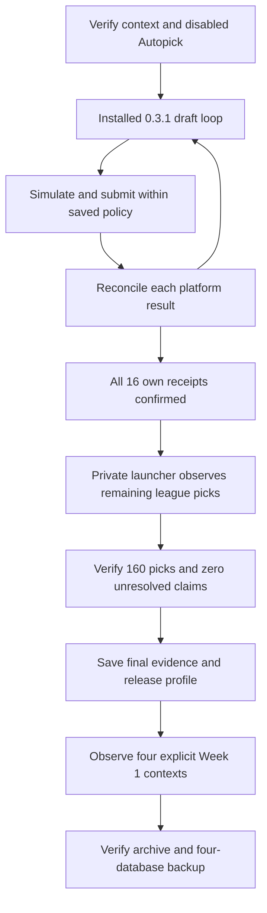

# Fourth draft acceptance

**Status: Verified automatic selection for all 16 own turns and complete live history on 2026-09-08.**

The manager confirmed every required selection in a 10-team PPR snake draft from slot 6.
The live server observation contains all 160 league picks and the complete 16-player roster.
No platform fallback, manual pick, package patch, or worker restart was required during this run.
One browser-control error recovered before the first selection received authorization.

## Runtime and configured policy

The server used installed version 0.3.1 from source commit `5fd4727d0f21751508c9caac3fba62ba03c8c756`.
All 22 installed package files matched the reviewed wheel before and after the draft.
The execution methods remained unchanged throughout the run.

A private orchestration launcher called the installed service APIs and collected the remaining league picks after the selected roster became full.
Its SHA-256 remained `e3af981127d850c965f749b7cb0cd25a6739037dcff442dd6cf1c23f8da1d36d`.
This verifies the installed adapter with that launcher. It does not verify the stock CLI's complete-history collection lifecycle.
The launcher did not replace package methods or apply a compatibility patch.

The league had 16 rounds. Draft mode was automatic and unpaused, with the `balanced_value` strategy.
The loop requested 40 trials per batch and a one-second interval.
The maximum draft-source age was 15 seconds. The maximum projection age was 3,600 seconds.
The server verified the exact league, team, and disabled ESPN Autopick before the first turn.
The separate host browser remained in the waiting room and submitted zero `DRAFT` clicks.

## Selection evidence

| Measure | Verified result |
|---|---:|
| Complete league history | 160 ordered, unique picks |
| Required own selections | 16 |
| Manager-confirmed receipts | 16 |
| Browser returns with `clicked=true` | 16 |
| Duplicate confirmed pick numbers | 0 |
| Platform fallback selections | 0 |
| Manual selections | 0 |
| Unresolved authorized claims at completion | 0 |

Each receipt matched the expected pick, player, and owner in the stored history.
Each selection had one authorization, one explicit clicked return, and one matching platform observation.
These records separate the attempted action from the observed result. Missing receipts alone would not establish ESPN Autopick.

| Round | Overall pick | Position | Authorization to observation (seconds) |
|---|---:|---|---:|
| 1 | 6 | WR | 1.348 |
| 2 | 15 | RB | 1.662 |
| 3 | 26 | RB | 1.890 |
| 4 | 35 | QB | 1.911 |
| 5 | 46 | WR | 2.221 |
| 6 | 55 | WR | 2.283 |
| 7 | 66 | TE | 2.520 |
| 8 | 75 | RB | 2.650 |
| 9 | 86 | WR | 2.874 |
| 10 | 95 | RB | 3.042 |
| 11 | 106 | RB | 3.395 |
| 12 | 115 | RB | 3.604 |
| 13 | 126 | WR | 3.875 |
| 14 | 135 | D/ST | 3.692 |
| 15 | 146 | RB | 3.867 |
| 16 | 155 | K | 4.315 |

The final roster contains one QB, seven RBs, five WRs, one TE, one D/ST, and one kicker.
The live D/ST selection succeeded under version 0.3.1.
The receipt does not establish whether that selection used autocomplete or an already visible row.
The exact autocomplete branch has separate [isolated Chrome evidence](ESPN_COMPATIBILITY.md).

## Recovered error and evidence limits

At the first turn, a prepared proposal did not receive authorization.
The worker then recorded one `browser_control` error category and entered `needs_attention`.
The next loop prepared a new proposal for the same player and confirmed pick 6.
No operator recovery or additional browser controller was required.

The durable event retains a message-pattern category, but not the exact error text.
Its precise root cause remains unverified. Do not substitute the earlier draft's error message.
The unused proposal remains `pending` without authorization. It is not an unresolved submitted action.
No further browser-control error category appears in the checked durable events.

An independent read-only supervisor collected 815 samples from 18:54:33 through 19:35:53 UTC.
The maximum sampled source age was 8.10 seconds. No sample showed enabled Autopick or source age above 10 seconds.
The maximum sampled awaiting-claim age was 2.85 seconds. The supervisor recorded zero read errors.
Discrete samples do not establish every state between observations.

The supervisor's SSH helper exited with code 1 after it recorded global completion, with empty stderr.
Its cleanup can terminate the SSH client. The exact helper exit cause was not logged.
The separate draft service exited successfully with `ExecMainStatus=0` and released its browser profile lease.
The helper exit does not establish a draft service failure.

## Measured simulation work

Durable calculation events contain **1,073 completed, accepted calls and 42,920 completed trials**.
No completed call was discarded. These totals sum individual calculation events rather than aggregate worker counters.
Trials estimate conditional player availability and projected value over a two-pick horizon.
More trials do not establish better selections, independent outcome samples, or championship odds.

All 16 receipts contain authorization and platform observation timestamps.
The median interval was **2.76 seconds**, with a **1.35–4.31 second range**, rounded from the recorded timestamps.
This measures authorization to platform observation. It does not measure exact click time, network latency, or the complete selection cycle.

## Complete history and season handoff

The final live `espn_browser` observation at 19:35:51 UTC contains 160 picks, terminal pick 161, and global draft completion.
The launcher saved that snapshot before releasing the browser. A separate check matched it to the stored snapshot and all 16 receipts.
No host-capture reconciliation or snapshot import was required.

All four teams then passed fresh Week 1 browser observation and selected-team lock checks.
The automatic lineup policy retained a 1.5-point minimum improvement.
No live server lineup swap qualified during the checked cycles.
The [server acceptance record](SERVER_ACCEPTANCE.md) contains the archive, backup, and health results.

This run verifies automatic draft selections under supervision with the stated private launcher.
It does not establish a general success rate, automatic fault recovery for other failures, or an unattended season.
The [second](LIVE_DRAFT_ACCEPTANCE.md) and [third](THIRD_DRAFT_ACCEPTANCE.md) draft failures remain historical evidence.
One additional draft and the five-team season evaluation remain [Planned](MULTI_TEAM_ACCEPTANCE.md).
Account identifiers, raw observations, and private deployment files remain outside the public repository.
