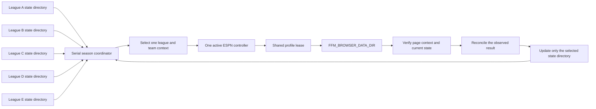

# Multi-team acceptance plan

**Status: All three additional drafts completed. Five-team Week 1 observation passed. One HTTP roster repair passed. Season outcomes remain Planned.**
The [third team draft](THIRD_DRAFT_ACCEPTANCE.md) is the first of the three additional trials.
It verified all 160 selections and a 16-player roster, with 13 manager-confirmed picks and three platform fallbacks.
The [fourth team draft](FOURTH_DRAFT_ACCEPTANCE.md) confirmed all 16 own selections and captured all 160 league picks.
It used unchanged installed version 0.3.1 execution methods with a private orchestration launcher.
One preauthorization browser error recovered without operator intervention. No platform fallback or manual selection was required.
The [fifth team draft](FIFTH_DRAFT_ACCEPTANCE.md) completed with 13 manager-confirmed picks, two direct host-browser picks, and one unattributed selection.
Missing opponent projection data blocked history normalization. Operator recovery completed the roster.
The final host capture matched all 132 previously stored picks and established all 160 league selections.
The five-team season evaluation remains planned. Season outcomes are not yet recorded.

Version 0.3.0 adds a serial season coordinator with separate league databases and a shared server browser.
Five-team Week 1 server observation and current lineup calculations are recorded in [server acceptance](SERVER_ACCEPTANCE.md).
Those historical browser checks did not establish unattended season completion or a live server lineup submission.

The deployed v0.4.0 candidate completed a separate five-team HTTP observation sweep.
All observations were fresh. Four teams had current analysis and required no lineup change.
One team had incomplete tight-end coverage, which kept overall analysis health degraded.
That initial sweep submitted no live HTTP transaction.

One team then received an explicitly authorized Week 1 coverage repair through the deployed candidate.
Two unchanged automatic engine steps confirmed a free-agent add/drop, then a lineup exchange, without a browser.
Both actions had ESPN `EXECUTED` receipts and matching roster observations. The previous starter remained on the bench.
Other roster players, starter assignments, and pending transactions stayed unchanged.
The execution harness applied temporary explicit limits and restored the original policy afterward.
This verifies the recorded repair for one team. Read [HTTP season acceptance](HTTP_SEASON_ACCEPTANCE.md) for the current deployment boundary.

## Failures to retain

The second live draft exposed these failures:

- Adapter startup failed before the first two selected-team turns. ESPN Autopick made those selections.
- A later player search required an autocomplete selection. The adapter timed out, and ESPN Autopick made that selection.
- A restart required complete history recovery. A `WR, CB` position label exposed another history parsing gap.

The completed trial verified all 160 league picks and a 16-player roster.
The manager confirmed 13 selections. ESPN Autopick made three selections during the failures.
The Week 1 connection and advisory lineup analysis also passed. No season action was submitted.
Keep these events in the acceptance record after fixes pass.
A later successful selection does not remove an earlier missed turn or manual intervention.
See the [live draft acceptance record](LIVE_DRAFT_ACCEPTANCE.md) for the final result and runtime details.

The third team draft exposed two further compatibility failures: API team-name whitespace and a D/ST selector delimiter.
The private runtime workaround, planned restart, late browser handoff, and three platform fallbacks remain recorded in the [third draft report](THIRD_DRAFT_ACCEPTANCE.md).
Version 0.3.1 fixes both compatibility cases in isolated tests.
The fourth draft adds live evidence for the installed adapter, including a confirmed D/ST selection.
That receipt does not establish which player-search branch was used.
The fifth draft exposed a separate missing-projection failure after 132 stored picks.
Version 0.3.2 retains verified opponent identities without assigning projected points.
The missed turn, two host selections, and unverified executor remain in the fifth report after the fix.

## Separate state and transport access

Give each league its own `FFM_DATA_DIR` or `--data-dir`.
Each directory stores that league's configuration, snapshots, proposals, and audit history.
The manager and ESPN processes for one league must use the same state directory.

The v0.4.0 coordinator uses HTTP by default and reads its protected session file through `FFM_ESPN_CREDENTIAL_FILE`.
A lease prevents simultaneous HTTP control of the same team through the same session directory.

Use `FFM_BROWSER_DATA_DIR` when controllers must share one authenticated browser profile.
The profile lease permits only one active controller at a time.
The current source can retain separate league state while controllers use that profile in sequence.
Five-team serial visits passed with fresh Week 1 data and current lineup calculations.

The diagram preserves the historical five-team browser configuration.
The [current architecture](ARCHITECTURE.md) describes HTTP season operation.
Use the [server instructions](SERVER.md) to configure explicit team and week contexts.

Do not schedule overlapping drafts on one shared profile.
Overlapping drafts require separate browser directories, authenticated sessions, and controller processes.
Do not copy profile cookies to create those sessions.
Do not treat one shared profile lease as concurrent draft support.

## Three additional drafts

Use one recorded source commit and dependency environment for each run.
Record any change during a run as an intervention and identify the new commit or patch state.
Keep deliberate fault injection in isolated browser tests.

| Run | Planned focus | Result |
|---|---|---|
| Draft A | Verify waiting-room entry, identity, disabled Autopick, and readiness before the first turn. | Completed as the third team draft. Failures required operator recovery. Thirteen picks have manager confirmations, and three have operator fallback labels. |
| Draft B | Repeat automatic selection with autocomplete, complete history, and platform receipts. | Completed as the fourth team draft. All 16 own selections have manager confirmations. Live D/ST selection passed. The exact autocomplete branch remains fixture evidence. |
| Draft C | Repeat through roster completion and verify the resulting league context for season monitoring. | Completed as the fifth team draft. Thirteen manager picks, two host picks, and one unattributed selection filled the roster. Missing projection data required recovery. The final host capture and later Week 1 observation passed separately. |

For each run:

1. Record the rules, draft order, roster size, source commit, and configured limits.
2. Verify the selected team and complete history before enabling automatic submissions.
3. Record every selected-team turn, including platform fallback and manual selections.
4. Reconcile each submitted action against the platform before another submission.
5. Verify the final roster and complete draft history.
6. Record failures, interventions, and unresolved results before assigning an outcome.

A complete automatic run requires confirmed manager submissions for every required selected-team turn.
Platform fallback, manual selections, missing receipts, and duplicate attempts must remain visible in that result.
A roster that becomes full through fallback selections does not establish complete manager automation.

## Five-team season evaluation

Give the teams anonymous labels A through E in public reports.
Record the scoring rules, lineup slots, and configured policy separately for each team.
Use an explicit scoring week when connecting a season controller.
The v0.4.0 HTTP coordinator can follow ESPN's verified current transaction period when `auto_rollover` is enabled.
Pending submissions and queued waivers retain their original week until reconciliation resolves them.

For each selected team and week:

1. Load the correct state directory and verify the ESPN context.
2. Read current ownership, weekly projections, and selected-team locks.
3. Calculate the legal lineup under that team's configured limits.
4. Submit supported actions only within the authorized mode and saved limits.
5. Verify the resulting roster and any transaction receipt before another change.
6. Record source age, lock coverage, interventions, and unresolved results.
7. Release the controller after the team visit.

The legacy browser lineup adapter applies one qualifying swap at a time.
Each intermediate swap must meet the configured improvement limit.
Some optimized targets require intermediate moves that fail that limit.
Report those cases without claiming that the whole target lineup was applied.

The HTTP adapter supports full lineup proposals, waivers, free-agent acquisitions, drops, IR moves, and IR activation.
Those paths have fictional test coverage. One authorized repair also verified live automatic free-agent add/drop and lineup execution.
Live waiver processing, IR moves, scoring-week rollover, and an unattended season remain Not Tested.
Trade execution remains outside the release scope. The v0.4.0 candidate is not yet a public release.
Keep recommendations and external manual actions separate from manager execution results.
Five-team monitoring and lineup changes alone do not establish fully automatic season management.
Selected-team lock evidence does not establish league-wide power-ranking coverage.

## Evidence to collect

| Measure | Required record |
|---|---|
| Draft completion | Required own selections, final roster size, complete history, and unresolved claims. |
| Selection source | Separate counts for manager-confirmed, ESPN Autopick, manual, and unknown selections. |
| Duplicate actions | Repeated click attempts or platform changes for the same intended action. Target: zero. |
| Source freshness | Observation age at calculation and submission, configured age limit, and stale-state blocks. |
| Receipt timing | Authorization-to-confirmation samples, sample count, and longest observed interval. |
| Manual intervention | Reason, time, affected turn or week, recovery steps, and result. |
| Correct league writes | Expected and observed context match for every action. Target: zero actions in the wrong context. |
| Week and locks | Requested week, observed week, lock coverage, and preservation of locked assignments. |
| Profile coordination | Lease contention, context transitions, unresolved claims, and controller shutdown results. |
| Simulation work | Actual completed trials, input revisions, reset events, and suppressed stale recommendations. |

These are acceptance measures, not reported outcomes.
Publish per-run and per-team results before combining them into an aggregate.
Report model scores and projected improvements as estimates.
Draft or matchup results do not establish that the model caused a win or a loss.

## Release and privacy boundary

Keep receipts, account identifiers, and raw captures outside the public repository.
Publish anonymous totals, timing samples, failure categories, and the tested source commit.
Do not publish league, team, member, player, or proposal identifiers from the live tests.

Run the full regression suite, including every isolated Chrome case, before the next release.
Keep the published version's evidence separate from working-tree experiments.
Record the completed drafts and season observations before making a multi-team acceptance claim.
