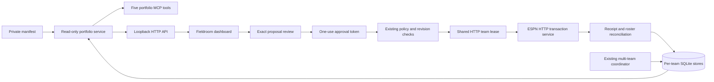
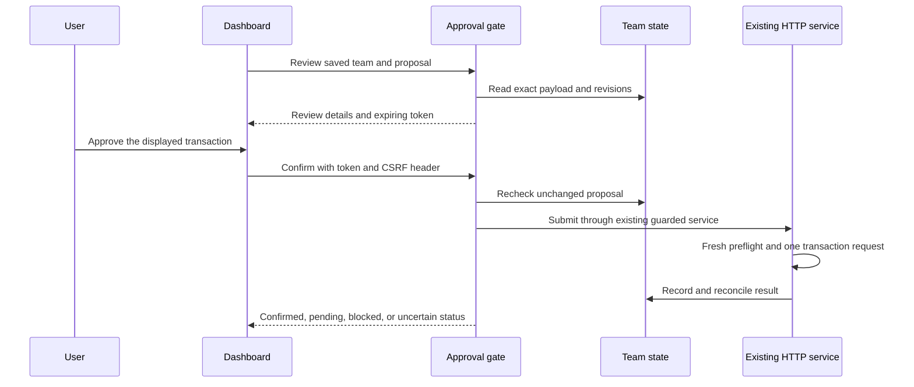

# Team portfolio and Fieldroom dashboard

Fieldroom displays multiple managed teams in one local workspace.
It shares a data service with the five-tool portfolio MCP.
The source checkout includes this feature. Public v0.3.3 does not include it.

## Start the fictional workspace

Run these commands from the source checkout:

```sh
uv sync --locked
uv run fantasy-football-dashboard --demo --enable-actions
```

Open `http://127.0.0.1:8765/`.
The packaged interface requires no Node.js runtime or ESPN account.
All demo teams, players, and proposals are fictional.
Demo submission changes the exact fictional lineup and its proposal in memory.
Restarting the process resets the demo.

Omit `--enable-actions` to disable approval and submission.
Use `--port` to select another local port.
The server accepts loopback addresses only.
Use `--open` only when you want the command to open a browser.

## Read actual managed teams

Set `FFM_PORTFOLIO_MANIFEST` to an existing private coordinator manifest.
Then run:

```sh
uv run fantasy-football-dashboard
```

The command also accepts `--manifest` followed by the private manifest path.
It reads the configured `leagues` entries and their per-team SQLite stores.
It does not discover directories or contact ESPN for portfolio reads.
The running coordinator remains responsible for fresh observations.
The interface refreshes saved data every 30 seconds while visible.

A dedicated portfolio manifest can use this schema:

```json
{
  "schema_version": 1,
  "teams": [
    {
      "key": "northside",
      "label": "Northside Wolves",
      "league_name": "Sunday League",
      "sport": "football",
      "provider": "espn",
      "data_dir": "./team-state"
    }
  ]
}
```

This example identifies a fictional team and relative directory.
Use your existing private state directories in the actual configuration.
Relative paths resolve from the manifest directory.
Optional `league_id`, `team_id`, and `season` fields bind an entry to one exact context.
Keys, state directories, and team contexts must be unique.
Each summary includes a stable `league_key` for league identity.
League counts use that key because display names can match or be absent.
Without a saved label, the interface displays the league ID from private local state.
The manifest permits at most 100 teams.

Keep manifests and credentials outside the public repository.
API responses exclude state paths, credential paths, cookies, and raw provider errors.

## Approve a saved proposal

Configure `FFM_ESPN_CREDENTIAL_FILE` with the existing protected HTTP session file.
Use the same credential directory as the coordinator so both processes share its team lease.
Then start the dashboard:

```sh
uv run fantasy-football-dashboard --enable-actions
```

The server also accepts `--credential-file` for an explicit private session path.
The browser never receives that path or the credentials.

Select a saved proposal in the dashboard.
Open its review panel.
Check its exact team, action, players, payload, saved mode, and limits.
Use the final approval control only when those details match your intended transaction.

Review creates a short-lived token for that exact proposal and its state revisions.
Submission consumes the token and rechecks the current proposal.
The existing HTTP service obtains the team lease and reads fresh ESPN evidence.
It applies policy, ownership, locks, pending commitments, and revision checks before submission.
A changed proposal requires another review. A busy team lease prevents concurrent submission.

The dashboard does not change automation modes or override protected players.
It submits current, pending HTTP season proposals in review mode only.
It does not create arbitrary transactions or run browser draft submissions.
The existing MCP tools still prepare proposals and preserve draft support.

`confirmed` requires the existing reconciliation checks.
`pending_waiver` means a claim is queued. It does not establish ownership.
An uncertain result requires reconciliation through the existing ESPN workflow.
Do not submit the same transaction again after an uncertain result.

## MCP tools

Configure the `fantasy-football-portfolio` command with the same private manifest.
The command reads `FFM_PORTFOLIO_MANIFEST` or accepts `--manifest`.
Use `--demo` for fictional MCP responses.

| Tool | Result |
| --- | --- |
| `list_managed_teams` | Team keys, contexts, freshness, and portfolio counts |
| `get_managed_team` | Selected roster, rules, budget, modes, and limits |
| `get_managed_analysis` | Pure lineup calculation from the saved snapshot |
| `search_managed_players` | Filtered players with separate league ownership contexts |
| `list_managed_proposals` | Saved actions, safe payloads, revisions, and execution status |

All five tools are read-only. They do not launch a browser or contact a provider.
The existing ESPN companion remains the MCP transaction interface.

## HTTP API

| Route | Filters or result |
| --- | --- |
| `GET /api/health` | Basic service status and source mode |
| `GET /api/session` | Action availability and same-origin request token |
| `GET /api/overview` | Optional `sport` and `provider` |
| `GET /api/teams/{key}` | One configured team |
| `GET /api/teams/{key}/analysis` | Saved-snapshot lineup calculation |
| `GET /api/players` | `team_key`, `query`, `position`, `rostered_only`, `limit`, `offset` |
| `GET /api/proposals` | `team_key`, `status`, `limit`, `offset` |

Read requests cannot change stored state.
`HEAD` is also available for the read routes.
Player and proposal pages accept `limit` from 1 through 200 and `offset` from 0 through 100000.
The `rostered_only` query parameter accepts `true` or `false`.
Omit optional query parameters instead of sending JSON `null` in the URL.

`GET /api/session` returns these fields:

| Field | Meaning |
| --- | --- |
| `actions_enabled` | True only when the server started with `--enable-actions` |
| `demo` | True for the explicit fictional workspace |
| `read_only` | True when action endpoints are disabled |
| `csrf_token` | Session token for POST requests, or null when actions are disabled |

Both action routes require these request headers:

| Header | Required value |
| --- | --- |
| `Host` | A permitted loopback hostname with the actual listening port |
| `Origin` | The exact `http://` origin of that Host value, without a trailing slash |
| `Content-Type` | `application/json`, optionally followed by `; charset=utf-8` |
| `X-FFM-CSRF` | The `csrf_token` from the current server's session response |
| `Content-Length` | One positive length, at most 8192 bytes |

Browsers set `Host`, `Origin`, and `Content-Length` for same-origin JSON POST requests.
The server rejects duplicate JSON keys, extra request fields, and transfer-encoded bodies.
Restarting the server invalidates its CSRF token and all open reviews.

`POST /api/review` accepts exactly `team_key` and `proposal_id` as JSON strings.
Both identify saved records. The client cannot supply an action payload or a state directory.
This route reads the exact proposal, snapshot, and policy before it issues a review token.
It returns these fields:

| Field | Meaning |
| --- | --- |
| `status` | `review_required` |
| `review_nonce` | One-use consent token bound to the team, proposal, payload, context, and decision inputs |
| `expires_in_seconds` | 120 |
| `proposal` | Exact action payload, current revisions, saved status, mode, and team context |
| `players` | IDs, names, and positions for the players involved in the review |
| `current_lineup` | Current starter slots mapped to player IDs |
| `policy` | Effective action mode, pause state, and current user limits |
| `demo`, `live_actions` | Separate fictional and live transaction scopes |

`POST /api/submit` accepts exactly four JSON fields:

| Field | Required value |
| --- | --- |
| `team_key` | The team from the review |
| `proposal_id` | The proposal from the review |
| `review_nonce` | The unused token from that review |
| `confirmation` | The JSON boolean `true` |

Submission consumes the token before it checks the current state and attempts the team lease.
A failed attempt cannot reuse that token.
An unchanged timestamp refresh can preserve consent, but freshness checks still run before submission.
Only existing ESPN HTTP season proposals in pending status and review mode can use the live action path.
Browser proposals and manager demo proposals cannot use that path.
The explicit fictional workspace has a separate in-memory lineup action.

A completed request returns `status`, `team_key`, `proposal_id`, `demo`, `live_actions`, `retry_allowed`, and a safe `message`.
`retry_allowed` is always false. The client must not repeat a submission automatically.

| Receipt status | Meaning |
| --- | --- |
| `confirmed` | Existing reconciliation verified the exact live change, or the explicit fictional lineup changed in memory |
| `pending_waiver` | ESPN accepted a queued claim; ownership is not confirmed |
| `rejected`, `cancelled` | ESPN returned a terminal result and the observed roster stayed unchanged |
| `conflict` | Transaction evidence and the observed roster differ |
| `busy` | Another HTTP service owns the team lease; this attempt made no transaction request |
| `not_submitted` | Submission did not begin or the existing service retained an unsubmitted proposal |
| `unknown` | The result requires reconciliation; this receipt does not authorize another transaction request |

Request failures return an `error` string without raw provider errors or private paths.
HTTP 400 indicates an invalid request. HTTP 403 indicates a failed origin or CSRF check.
HTTP 409 indicates an expired review, changed state, unavailable proposal, or concurrent dashboard action.
HTTP 405 blocks action routes when actions are disabled. HTTP 503 indicates an unavailable operation.

The server rejects arbitrary filesystem paths, cross-origin requests, and static traversal.
It sends a restrictive content policy and disables response caching.
Same-origin frame restrictions permit an authenticated media UI proxy without allowing arbitrary embedding sites.

## Data meaning and limits

Unknown projections display as an em dash. They do not become zero.
Saved player-pool membership does not prove current availability.
Recommendations are calculations. They are not saved approvals or confirmed transactions.
Each proposal retains its saved status and a separate current-revision flag.
History reads load at most 500 records per team.
When `truncated` is true, `total_scope` describes loaded records only.

Missing, invalid, stale, and unsupported team stores remain visible.
A failed team does not suppress other teams.
Draft teams can appear in the portfolio, but this interface does not run draft simulations.
The existing draft MCP retains that function.

Football is the only implemented sport.
The manifest and API carry `sport` and `provider` fields for future adapters.
Other sports require their own schemas, rules, normalization, analysis, and transaction validation.
Those adapters are Planned, not implemented.

## Architecture





## Build the interface

The React source is in `web/`.
The Python wheel includes the production files in `dashboard_static/`.
End users do not need a frontend build tool.
After changing frontend source, rebuild the packaged assets and run the UI tests.
See [dashboard validation](PORTFOLIO_VALIDATION.md) for commands, screenshots, and current test limits.
See the [media UI handoff](MEDIA_UI_HANDOFF.md) for authenticated server integration.
