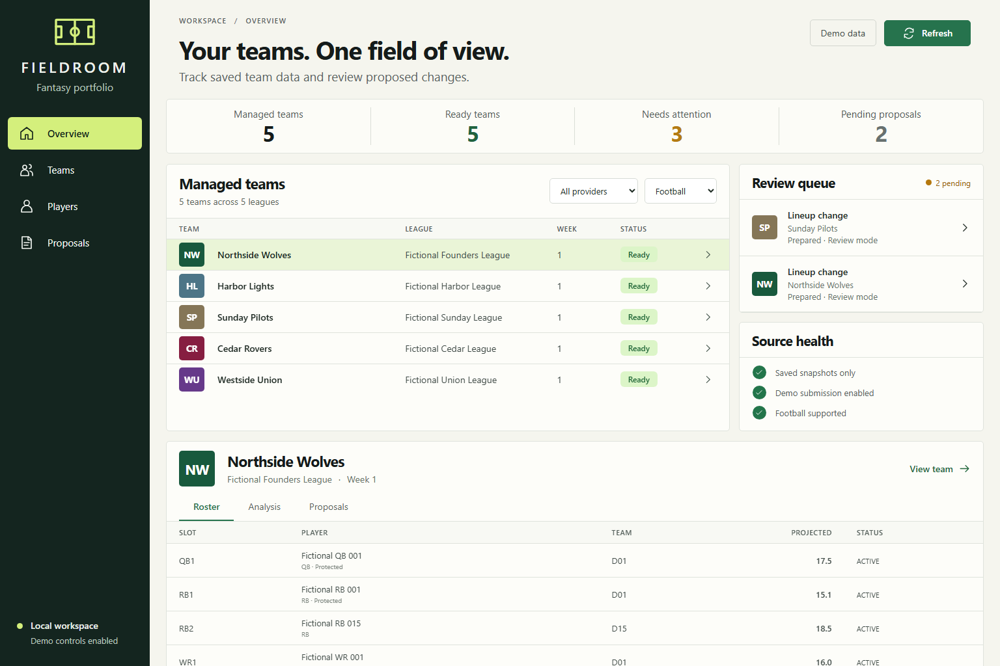
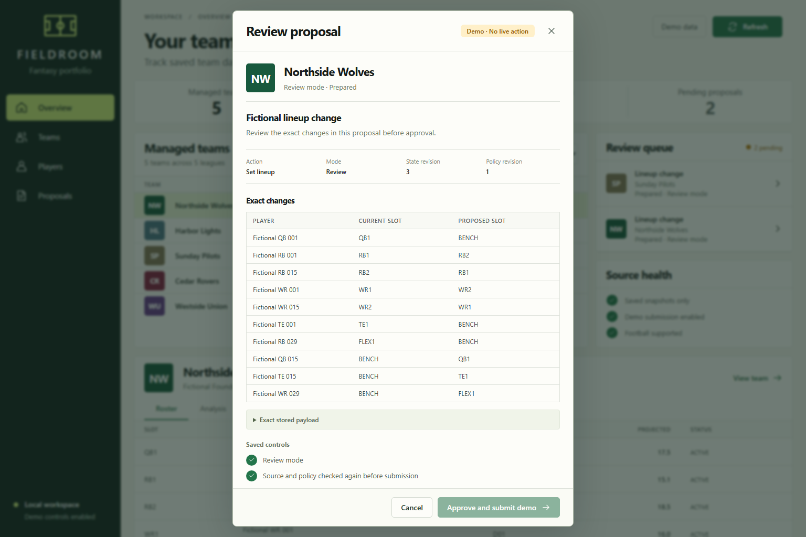
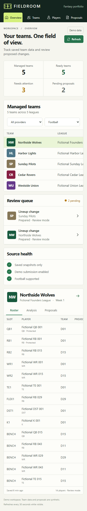

# Portfolio dashboard validation

## Scope

This record covers the portfolio data service, five MCP tools, Fieldroom UI, and optional HTTP proposal controls.
The existing draft and season engines retain their interfaces.
The feature remains part of the unreleased v0.4.0 source candidate.

## Verified data access

On September 10, 2026, a read-only check inspected five actual managed team stores.
It used the new portfolio module with network connections disabled.
It did not import the manager constructor or provider service.

| Observation | Result |
| --- | --- |
| Managed teams | 5 |
| Ready snapshots | 5 |
| Successful lineup analyses | 5 |
| Owned players | 78 |
| Per-team roster sizes | 14, 16, 16, 16, 16 |
| Loaded proposal records | 74 |
| Truncated or malformed history | None |
| Elapsed read time | 1.028 seconds for this five-team check |
| Revisions, policy, and proposal counts | Unchanged |
| State-directory file inventory | Unchanged |
| Coordinator | Active before and after |
| Provider calls and live submissions | 0 |

This measurement applies to one installed environment and five stored teams.
It does not establish performance for the 100-team manifest limit.
Private identifiers, paths, and credentials are excluded from this record.

## Transaction verification

Tests use the existing ESPN service against an isolated simulated ESPN provider.
They exercise the actual policy, HTTP action, lease, receipt, and reconciliation code.
They do not send ESPN transactions.

Verified cases include:

- Exact approval submits one transaction and updates the observed lineup.
- Queued waivers preserve ownership until reconciliation confirms an acquisition.
- A timeout after a submitted transaction returns an uncertain result without a retry.
- Rejected transactions remain separate from uncertain results.
- Changed policy or decision inputs invalidate an earlier review.
- Timestamp-only refreshes preserve consent while freshness checks still apply.
- Expired, reused, or mismatched review tokens cannot submit.
- An active team lease prevents a second controller from submitting.
- Review reads do not construct a manager or modify team state.
- Submission preserves the coordinator's saved connection and healthy worker status.
- Cross-origin, invalid CSRF, duplicate-field, oversized, and extra-field requests fail.

## Browser verification

The Browser plugin was not available in this session.
Tests used the installed Playwright library with headless Google Chrome.
The test URL used a loopback address and a temporary port.
The visual demo used `http://127.0.0.1:8765/`.

The flow under test was: open the workspace, inspect a team, review an exact proposal, approve it, and verify the result.

| Check | Result |
| --- | --- |
| Page identity and nonblank content | Pass |
| Framework error overlay | None |
| Console errors in successful flows | None |
| External UI requests | None |
| Team selection and analysis | Pass |
| Player search, team filter, and position filter | Pass |
| Missing projection display | Pass. Unknown values remain unknown |
| Approval checkbox and duplicate-submit prevention | Pass |
| Actual HTTP pending status in the UI | Pass against the simulated provider |
| Confirmed, queued-waiver, and uncertain outcomes | Pass against the simulated provider |
| Disabled submission controls | Pass |
| Empty configuration and failed data request | Pass |
| Mounted `/fantasy/` proxy prefix | Pass with route forwarding |
| Desktop viewport | 1440 × 1000 functional tests; 1536 × 1024 screenshots |
| Mobile viewport | 390 × 844 |
| Mobile page overflow | None. Wide tables scroll within their containers |

The mobile check found an offscreen accessible table label outside its scroll container.
The fix positioned the label relative to that container.
The page no longer requires horizontal scrolling.

The proxy-prefix test verifies paths and requests.
It does not verify the user's media application, authentication, or reverse-proxy deployment.

## Design comparison

The design reference uses an ivory workspace, a forest sidebar, and a lime active navigation item.
The implementation uses local system fonts and simple vector icons.
The generated images are design references. The browser screenshots show the running application.

| Comparison point | Reference and rendered result |
| --- | --- |
| Desktop structure | Persistent left navigation, page header, four summary values, team table, review rail, and team detail |
| Color and borders | Forest, ivory, and lime palette retained with thin borders and restrained corners |
| Main copy | The headline, subtitle, navigation, section titles, and Refresh control match the reference |
| Team data | The running API supplies all values. Fictional leagues, counts, players, and weeks differ from the concept |
| Status counts | Ready and attention counts can overlap. Pending proposals and missing projections also need attention |
| Detail position | The desktop detail panel begins near the reference position after redundant rail notes were removed |
| Roster | Full saved roster replaces the concept's four-row preview. Starters precede bench and IR players |
| Approval | Named changes, exact payload, current policy, explicit confirmation, and a separate final submission control |
| Approval size | The real demo has more changed slots than the two-row concept. The dialog scrolls to preserve every change |
| Mobile | Compact navigation and stacked panels replace the desktop columns. Tables retain local scrolling |

The main above-the-fold copy remains unchanged.
The source-health and access labels reflect whether submission controls are enabled.
The system font, vector icon, exact data, and complete roster are intentional differences.
No pixel-identical or formal visual-conformity claim is made.

## Reproduce the checks

Local validation passed with 1,219 Python tests and 31 environment-dependent skips.
Eight separately enabled dashboard browser tests passed.
Five frontend unit tests passed.
The wheel and source distribution passed package metadata validation.
The plugin and its new portfolio skill passed their validators.

Run Python tests from the repository root:

```sh
uv sync --locked --dev
uv run pytest -q
uv run python scripts/validate_release.py
```

Build the interface from `web/`:

```sh
npm ci
npm test
npm run build
```

Set `FFM_DASHBOARD_BROWSER_TESTS=1` in your shell.
Install Google Chrome through Playwright when required.
Then run:

```sh
uv run pytest -q tests/test_dashboard_browser.py
```

The CI dashboard job rebuilds the interface and rejects differences from the packaged static files.
The package job depends on that check and the existing Python, browser-draft, and PostgreSQL jobs.

## Not Tested and Planned

- Live dashboard submission against ESPN: Not Tested. No unnecessary roster move was made for UI acceptance.
- Media UI authentication and deployment: Not Tested. The [handoff prompt](MEDIA_UI_HANDOFF.md) defines that work.
- Other sports and providers: Planned. Only football is implemented.
- UI configuration editing and arbitrary transaction creation: Not implemented. Existing MCP tools retain those preparation and policy workflows.
- Browser draft submission through this dashboard: Not implemented. Existing draft support remains available.
- Firefox, Safari, and additional mobile devices: Not Tested.

## Visual evidence

The [overview concept](assets/portfolio/concept.png) and [approval concept](assets/portfolio/review-concept.png) are generated design references.
The following screenshots use fictional data only.






