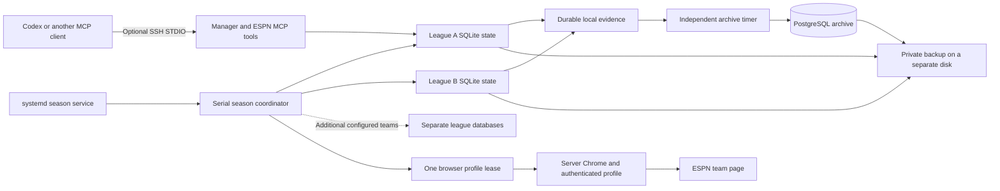

# Server operation and evidence archive

Version 0.3.0 adds a serial season coordinator and a PostgreSQL evidence archive.
The browser, worker, and databases run on the Linux server.
The operator computer supplies an optional control connection. It does not supply the browser process.

Use these terms consistently: **coordinator** selects league contexts, **manager database** holds active state, and **archive** retains evidence.
All deployment files, identifiers, browser profiles, and backups remain private.
Repository examples use generic service paths and fictional league identifiers.

## Components



SQLite remains the source of active policy, proposals, and action claims.
PostgreSQL stores immutable evidence for later analysis.
A failed archive connection does not block a draft action.
An unsuccessful local evidence transaction blocks its associated authorization before the browser receives a click permit.

## Prepare the server

Use Python 3.11 or later, Google Chrome, PostgreSQL, and a dedicated service account.
Install the optional database dependency:

```sh
uv sync --locked --extra server
```

Create a database owned by the dedicated service role.
Use local Unix-socket authentication when the application and PostgreSQL share the server.
Keep the role unprivileged. Keep PostgreSQL off public interfaces unless another deployment explicitly requires remote access.
See PostgreSQL's [peer authentication documentation](https://www.postgresql.org/docs/16/auth-peer.html).

Sign in to a dedicated Chrome profile on the server.
A temporary desktop connection can show a virtual display through a loopback SSH tunnel.
Close the sign-in controller before the coordinator opens that profile.
The server must retain its own authenticated session after the tunnel closes.
Do not copy a personal browser profile or password store into the repository.

Create each manager database through an explicit league connection or a consistent SQLite backup.
Preserve the original database until server verification passes.
Give each league a separate directory.

## Configure the coordinator

Create a private manifest outside the checkout:

```json
{
  "browser_data_dir": "browser",
  "status_file": "season-status.json",
  "headless": false,
  "leagues": [
    {
      "league_id": "10001",
      "team_id": "1",
      "season": 2026,
      "week": 1,
      "data_dir": "leagues/team-a",
      "phase": "season",
      "mode": "automatic",
      "enabled": true
    }
  ]
}
```

Relative paths resolve from the manifest directory.
The `mode` field checks saved lineup authorization. It does not change that authorization.
Use `existing` to accept the database's saved mode.
Set limits and strategies through the manager configuration tools before enabling actions.

Run a single verification sweep:

```sh
fantasy-football-server --manifest "$PRIVATE_LEAGUE_MANIFEST" --once
```

Start continued operation:

```sh
fantasy-football-server --manifest "$PRIVATE_LEAGUE_MANIFEST" --interval 60
fantasy-football-server --manifest "$PRIVATE_LEAGUE_MANIFEST" --health
```

The interval follows the complete sweep. It is not a per-team deadline.
Health requires a current heartbeat and a recent successful observation for every enabled team.
Each team retains its own age limit, policy, and pending claims.
Future or malformed timestamps produce an unhealthy result.

The coordinator connects, observes, evaluates one season step, and closes Chrome for each team.
A team failure does not change another team's state.
Authentication failure or profile contention stops the remaining visits in that sweep.
An uncertain browser cleanup stops the coordinator before another visit.
SIGTERM requests a cooperative stop and lets the current action reconcile.

Use the [systemd templates](../deployment/systemd/) as generic starting points.
Set the actual account, paths, mount dependencies, display, and environment only in private installation files.
Enable the coordinator and archive timer after verification.
Verify both restart recovery and database restore.

## Connect an MCP client

The two MCP commands can run on the server through SSH STDIO.
Keep the SSH destination, account, and command paths in private client configuration.
Use the same remote manager directory for both commands.
That MCP pair controls one selected league. The coordinator visits every enabled league in its separate manifest.
An operator can select another private directory when configuring another MCP pair.

Preserve `PROGRAMDATA` when a Windows MCP host filters environment variables for OpenSSH.
The tested OpenSSH client exited before initialization when that variable was absent.
Adding it to the private MCP environment restored both handshakes.

Manager reads and configuration updates can use the coordinator's SQLite databases.
Stop the coordinator before an MCP session takes direct browser control of its shared profile.
Restart the coordinator after the interactive controller disconnects.
Do not start another standalone worker against a profile that the coordinator owns.
The profile lease blocks simultaneous browser ownership.

## Preserve labeled evidence

Create a private archive manifest:

```json
{
  "schema_version": 1,
  "sources": [
    {
      "source_id": "season-team-a",
      "run": {
        "run_id": "season-collection-001",
        "kind": "live_collection",
        "label": "Season observation collection",
        "runtime_version": "0.3.0",
        "code_revision": null
      },
      "context": {"league_id": "10001", "team_id": "1", "season": 2026},
      "database": "leagues/team-a/manager.sqlite3"
    }
  ]
}
```

Set `code_revision` to the actual source commit when known.
Use a new run identifier after runtime or source changes.
Preserve unknown historical provenance as `null`.
Do not attribute a run with changing development patches to one released wheel.

```sh
fantasy-football-archive export --manifest "$PRIVATE_ARCHIVE_MANIFEST" --output "$PRIVATE_BUNDLE"
fantasy-football-archive import --bundle "$PRIVATE_BUNDLE" --dsn "dbname=fantasy_football"
fantasy-football-archive sync --manifest "$PRIVATE_ARCHIVE_MANIFEST" --dsn "dbname=fantasy_football"
```

The archive uses content hashes and one transaction for each bundle.
Repeated imports do not duplicate records or labels.
It retains source context and separate observation, recording, and ingestion timestamps.
Calculations retain actual completed trials, requested trials, seed, and input revisions when available.
Historical exports cannot recover evidence that the original runtime never recorded.

| Table | Contents |
|---|---|
| `archive_imports` | Bundle identity, import time, and content-hash manifest. |
| `archive_runs` | Immutable run identity and known runtime provenance. |
| `archive_records` | Snapshots, picks, proposals, calculations, events, and classified failures. |
| `archive_labels` | Evidence-backed labels and explicit operator observations. |

Authorization, browser return, and platform confirmation are separate records.
A confirmed pick does not prove which actor caused it without supporting evidence.
A missing receipt or `not_selected` result does not establish ESPN Autopick.
Explicit operator observations can label known fallback selections.

The exporter removes account names, fantasy-team names, credentials, and private paths from structured evidence.
Snapshot exports use canonical ESPN URLs with the required context and no account query values.
League and team identifiers remain in the private archive for context matching.
The archive is not a public dataset. Public samples require a separate privacy review and anonymization.

## Backups and recovery

The backup helper uses PostgreSQL custom-format dumps and SQLite's backup API.
It includes only databases selected in the archive manifest and explicitly supplied private configuration files.
It excludes Chrome profiles and credentials.
Completed backup sets include checksums and a completion marker.
Retention applies only to recognized completed sets in the configured backup directory.

```sh
python deployment/backup.py --manifest "$PRIVATE_ARCHIVE_MANIFEST" --output-dir "$PRIVATE_BACKUP_DIRECTORY" --dsn "dbname=fantasy_football" --config "$PRIVATE_LEAGUE_MANIFEST" --retention-days 14
```

Store backups on another disk when available.
Restore a dump into a separate validation database before claiming recovery works.
Check SQLite backup integrity and compare archive table counts.
These backups do not provide synchronized point-in-time recovery across PostgreSQL and all SQLite databases.
After recovery, the archive importer can replay durable local evidence without duplicate records.

## Current limits

- Season scheduling supports explicit team and week contexts. Automatic week rollover remains planned.
- A qualifying lineup swap can run automatically within saved limits. Each intermediate swap must meet those limits.
- Draft automation uses the separate draft worker. The season coordinator rejects draft entries.
- Overlapping drafts require independently authenticated profiles and separate workers.
- Live waivers, acquisitions, drops, and trades remain planned.
- An expired ESPN session requires sign-in. A running service alone does not prove healthy observations.
- Two-team server verification does not establish five-team season acceptance or an unattended season.

Read the [multi-team acceptance plan](MULTI_TEAM_ACCEPTANCE.md) before extending the evaluation.
