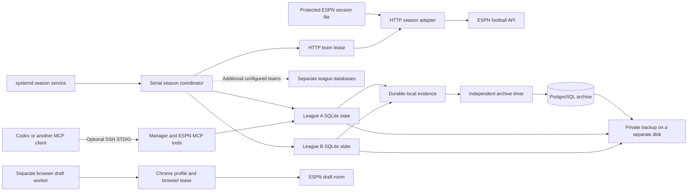

# Server operation and evidence archive

Version 0.3.0 adds a serial season coordinator and a PostgreSQL evidence archive.
The unpublished v0.4.0 candidate uses HTTP by default for season operation.
The worker, protected ESPN session, and databases run on the Linux server.
HTTP season operation requires neither Chrome, Playwright, Xvfb, nor a display.
The operator computer supplies an optional control connection and can remain off between control sessions.
Draft operation retains an explicit browser worker.

Use these terms consistently: **coordinator** selects league contexts, **manager database** holds active state, and **archive** retains evidence.
All deployment files, identifiers, session files, browser profiles, and backups remain private.
Repository examples use generic service paths and fictional league identifiers.

## Components



SQLite remains the source of active policy, proposals, and action claims.
PostgreSQL stores immutable evidence for later analysis.
A failed archive connection does not block a draft action.
An unsuccessful local evidence transaction blocks its associated authorization before the adapter receives a submission permit.

## Prepare the server

Use Python 3.11 or later and a dedicated service account.
Use PostgreSQL when the deployment includes the optional evidence archive.
Install source dependencies for that archive:

```sh
uv sync --locked --extra server
```

Create a database owned by the dedicated service role.
Use local Unix-socket authentication when the application and PostgreSQL share the server.
Keep the role unprivileged. Keep PostgreSQL off public interfaces unless another deployment explicitly requires remote access.
See PostgreSQL's [peer authentication documentation](https://www.postgresql.org/docs/16/auth-peer.html).

For HTTP operation, configure a private session file with only ESPN `SWID` and `espn_s2`.
Set the manifest's `credential_file`, or use `FFM_ESPN_CREDENTIAL_FILE` in the service environment.
Keep the file under the service account's ownership with mode `0600`.
Use a private parent directory with mode `0700` that the service account can write.
HTTP team leases use that directory beside the session file.
Do not place credential values in the manifest, command line, repository, or MCP arguments.
See [HTTP session setup](PLUGIN_INSTALL.md#configure-an-http-season-session-unreleased) for the optional Linux `v10` importer.
That importer requires the `session-import` extra and does not start Chromium.
It does not renew an expired session or supply unattended password sign-in.

Create each manager database through an explicit league connection or a consistent SQLite backup.
Preserve the original database until server verification passes.
Give each managed league and team context a separate directory.

## Configure the coordinator

Create a private manifest outside the checkout:

```json
{
  "browser_data_dir": "/var/lib/fantasy-football/runtime",
  "status_file": "/var/lib/fantasy-football/season-status.json",
  "transport": "http",
  "credential_file": "/var/lib/fantasy-football/private/espn-session.json",
  "auto_rollover": true,
  "headless": true,
  "leagues": [
    {
      "league_id": "10001",
      "team_id": "1",
      "season": 2026,
      "week": 1,
      "data_dir": "/var/lib/fantasy-football/leagues/team-a",
      "phase": "season",
      "mode": "existing",
      "enabled": false
    }
  ]
}
```

Relative paths resolve from the manifest directory.
The [HTTP example manifest](../deployment/leagues.http.example.json) contains two disabled fictional contexts.
Replace their identifiers and paths in a private copy before enabling entries.
The required `browser_data_dir` field also holds the coordinator lease in HTTP mode.
Its historical name does not mean that HTTP operation starts a browser.
`headless` affects only browser mode. The HTTP adapter ignores it.

The `mode` field checks saved lineup authorization. It does not change that authorization.
Use `existing` to accept the database's saved mode.
Acquisitions, drops, and IR moves use their separate saved action modes.
Set authorized limits and strategies through the manager tools before enabling entries.
An automatic lineup mode does not grant drop or acquisition permission.

Coordinator `auto_rollover` defaults to true. Set it to false to retain the requested week.
Direct MCP connections have a separate false default.
HTTP rollover follows ESPN's verified current transaction period and never moves backward.
Pending waivers and unresolved submissions retain their original week until reconciliation.
An old-week observation cannot authorize a current-period transaction.

Run one sweep:

```sh
fantasy-football-server --manifest "$PRIVATE_LEAGUE_MANIFEST" --once
```

`--once` uses saved authorization and can submit actions. It is not an observation-only option.
For an observation-only sweep, save the shared pause in each selected manager configuration first.

Start continued operation:

```sh
fantasy-football-server --manifest "$PRIVATE_LEAGUE_MANIFEST" --interval 60
fantasy-football-server --manifest "$PRIVATE_LEAGUE_MANIFEST" --health
```

The interval follows the complete sweep. It is not a per-team deadline.
Health requires a current heartbeat and a recent successful observation for every enabled team.
Each team retains its own age limit, policy, and pending claims.
Future or malformed timestamps produce an unhealthy result.

The coordinator connects, observes, evaluates one season step, and closes the connection for each team.
Each HTTP visit can submit at most one transaction that passes policy.
An acquisition and a later starter assignment require separate confirmed transactions.
A team failure does not change another team's state.
ESPN authentication errors or a busy browser profile can stop the remaining visits in that sweep.
An uncertain connection cleanup stops the coordinator before another visit.
SIGTERM requests a cooperative stop. The current bounded operation can finish.

HTTP controllers share a team lease through the protected credential directory.
This lease prevents simultaneous control of one league and team across separate manager databases.
Different teams have separate leases. Unrelated copies of credentials do not share this protection.
The coordinator also holds a process lease in `browser_data_dir` to prevent duplicate sweeps through that root.

The health report distinguishes fresh observations from lineup analysis and action readiness.
Healthy observations do not prove that every action is permitted or that a live write succeeded.
`pending_waiver` does not establish ownership. `not_submitted` identifies a proved failure before the transaction request began.
An uncertain submission requires reconciliation without another POST or replacement proposal.

Use the [systemd templates](../deployment/systemd/) as generic starting points.
Set the actual account, paths, mount dependencies, and environment only in private installation files.
The HTTP season service has no display or Xvfb dependency.
Enable the coordinator and archive timer after verification.
Verify both restart recovery and database restore.

## Connect an MCP client

The two MCP commands can run on the server through SSH STDIO.
Keep the SSH destination, account, and command paths in private client configuration.
Use the same remote manager directory for both commands.
That MCP pair controls one selected league. The coordinator visits every enabled league in its separate manifest.
An operator can select another private directory when configuring another MCP pair.

Preserve `PROGRAMDATA` when a Windows MCP host filters environment variables for OpenSSH.
The tested OpenSSH client exited before initialization when that variable was absent.
Adding it to the private MCP environment restored both handshakes.

Manager reads and configuration updates can use the coordinator's SQLite databases.
Stop the coordinator before another HTTP controller takes over one of its team contexts.
Use the same protected credential directory for that controller.
Restart the coordinator after the controller disconnects and releases its team lease.
Manager reads do not require an ESPN connection or browser.

## Explicit browser and draft setup

Install the `browser` extra and Google Chrome for draft or legacy browser operation:

```sh
uv sync --locked --extra server --extra browser
```

Sign in to a dedicated server Chrome profile through a separately authorized browser session.
Use `headless: false` only when that browser has an available display.
A separately managed virtual display is optional for this browser workflow.
HTTP season operation does not require that display or a retained browser process.
Keep browser profile data and any private `DISPLAY` configuration outside the repository.

Use [the browser season manifest](../deployment/leagues.browser.example.json) for explicit legacy season operation.
It sets `transport: "browser"` and `auto_rollover: false`.
The browser profile lease permits one controller at a time, including controllers for different leagues.
Disconnect the current browser controller before another worker uses its profile.

The season coordinator rejects draft entries.
For drafts, save an explicit `phase="draft"` connection through the ESPN companion in the draft manager directory.
Verify the requested team, draft room, and disabled ESPN Autopick before enabling automatic picks.
Preserve the user's saved draft mode and limits.
Use the [draft worker template](../deployment/systemd/fantasy-football-draft.service) only with that saved draft connection.
It uses a separate profile root and manager directory.
Overlapping drafts require separate authenticated profiles and separate workers.
See [ESPN automation](ESPN_AUTOMATION.md) for the browser draft submission and reconciliation procedure.

## Preserve labeled evidence

Create a private archive manifest:

```json
{
  "schema_version": 1,
  "sources": [
    {
      "source_id": "season-team-a",
      "run": {
        "run_id": "season-collection-001",
        "kind": "live_collection",
        "label": "Season observation collection",
        "runtime_version": "0.4.0",
        "code_revision": null
      },
      "context": {"league_id": "10001", "team_id": "1", "season": 2026},
      "database": "leagues/team-a/manager.sqlite3"
    }
  ]
}
```

The run's `runtime_version` and `code_revision` describe the collection environment.
Set `code_revision` to the collector's actual source commit when known.
Use a new run identifier after collection software or source selection changes.
Preserve unknown collection provenance as `null`.

A collection can contain copied historical records and new outbox events.
Its run version does not identify the software that executed every historical action.
The bundle's `exporter_version` identifies the sanitizer and export software.
An outbox event's `application_version` identifies the software that produced that event.
That field alone does not prove who caused an underlying action or which software performed it.
Historical execution versions remain unknown unless separate evidence establishes them.
Keep existing immutable run metadata unchanged when documenting this distinction.

```sh
fantasy-football-archive export --manifest "$PRIVATE_ARCHIVE_MANIFEST" --output "$PRIVATE_BUNDLE"
fantasy-football-archive import --bundle "$PRIVATE_BUNDLE" --dsn "dbname=fantasy_football"
fantasy-football-archive sync --manifest "$PRIVATE_ARCHIVE_MANIFEST" --dsn "dbname=fantasy_football"
```

The archive uses content hashes and one transaction for each bundle.
Repeated imports do not duplicate records or labels.
It retains source context and separate observation, recording, and ingestion timestamps.
Calculations retain actual completed trials, requested trials, seed, and input revisions when available.
Historical exports cannot recover evidence that the original runtime never recorded.

| Table | Contents |
|---|---|
| `archive_imports` | Bundle identity, import time, and content-hash manifest. |
| `archive_runs` | Immutable collection identity and known collection-environment provenance. |
| `archive_records` | Snapshots, picks, proposals, calculations, events, and classified failures. |
| `archive_labels` | Evidence-backed labels and explicit operator observations. |

Authorization, transport return, and platform confirmation are separate records.
A confirmed pick does not prove which actor caused it without supporting evidence.
A missing receipt or `not_selected` result does not establish ESPN Autopick.
Explicit operator observations can label known fallback selections.

The exporter removes account names, fantasy-team names, credentials, and private paths from structured evidence.
Snapshot exports use canonical ESPN URLs with the required context and no account query values.
League and team identifiers remain in the private archive for context matching.
The archive is not a public dataset. Public samples require a separate privacy review and anonymization.

## Backups and recovery

The backup helper uses PostgreSQL custom-format dumps and SQLite's backup API.
It includes only databases selected in the archive manifest and explicitly supplied private configuration files.
The default template does not select browser profiles or HTTP session files.
The helper rejects browser-profile paths, but it copies explicitly supplied `--config` files.
Do not supply a credential file as `--config`.
Completed backup sets include checksums and a completion marker.
Retention applies only to recognized completed sets in the configured backup directory.

```sh
python deployment/backup.py --manifest "$PRIVATE_ARCHIVE_MANIFEST" --output-dir "$PRIVATE_BACKUP_DIRECTORY" --dsn "dbname=fantasy_football" --config "$PRIVATE_LEAGUE_MANIFEST" --retention-days 14
```

Store backups on another disk when available.
Restore a dump into a separate validation database before claiming recovery works.
Check SQLite backup integrity and compare archive table counts.
These backups do not provide synchronized point-in-time recovery across PostgreSQL and all SQLite databases.
After recovery, the archive importer can replay durable local evidence without duplicate records.

## Current limits

- HTTP season scheduling supports automatic rollover from verified period evidence. Fictional tests passed. Live rollover remains **Not Tested**.
- Pending transactions can hold the original week.
- HTTP lineups, acquisitions, drops, and IR moves require current source evidence and separate saved permissions.
- Legacy browser lineups support one qualifying swap per proposal and require an explicit week.
- Draft automation uses the separate draft worker. The season coordinator rejects draft entries.
- Overlapping drafts require independently authenticated profiles and separate workers.
- Trade execution remains unavailable.
- An expired HTTP session requires renewed authorized credentials. A running service alone does not prove healthy observations.
- Five-team authenticated HTTP reads do not establish live transaction acceptance or an unattended season.

Read the [multi-team acceptance plan](MULTI_TEAM_ACCEPTANCE.md) before extending the evaluation.
The v0.3.3 release and older server records remain historical evidence.
The reviewed v0.4.0 wheel is deployed privately. Its first HTTP sweep returned five fresh observations and four current lineup analyses.
The remaining team had incomplete tight-end coverage. That initial sweep submitted no live HTTP write.
A later authorized repair completed an automatic free-agent add/drop and a subsequent lineup exchange on 2026-09-10 UTC.
Both transactions had matching ESPN receipts and fresh roster observations. The previous policy was restored after verification.
A follow-up cycle found current analysis for all five teams, healthy overall status, and no duplicate submission.
Live waiver processing, IR moves, scoring-week rollover, and an unattended season remain **Not Tested**.
Read [HTTP season acceptance](HTTP_SEASON_ACCEPTANCE.md) for package verification and the remaining acceptance gates.
See [validation status](VALIDATION.md) and the [HTTP source contract](ESPN_HTTP_COMPATIBILITY.md) for the evidence boundary.

## Stable release observation

Read [Stable release readiness](STABLE_RELEASE_READINESS.md) for the independent acceptance collector, backup verification, and loopback readiness page.
The collector preserves the running coordinator and saved transaction policies.
