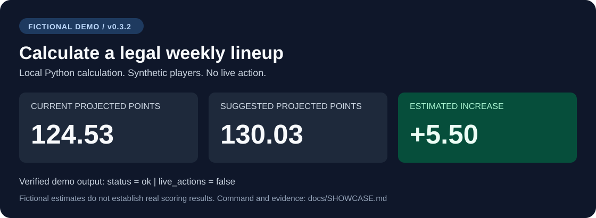

# Developer showcase

Fantasy Football Manager connects Codex and other MCP clients to ESPN draft and lineup tools.
The project combines local calculations, explicit action modes, browser observations, and durable action records.
It is an independent MIT-licensed project.

## Try it without an account

Use Python 3.11 or later and [uv](https://docs.astral.sh/uv/).
Run the published fictional demo:

```sh
uvx --from fantasy-football-manager==0.3.2 fantasy-football-manager --demo
```

The command requires no ESPN sign-in, Chrome session, or MCP client.
It calculates in memory and does not change saved league state.



**Verified on 2026-09-09:** v0.3.2 returned this excerpt with no errors or warnings:

```json
{
  "data": "fictional_demo",
  "live_actions": false,
  "status": "ok",
  "projected_points": 130.03,
  "current_projected_points": 124.53,
  "improvement": 5.5
}
```

The 5.50-point difference is an estimate from fictional inputs. It does not measure a real scoring improvement.
The [demo source](../src/fantasy_football_manager/demo.py) defines the inputs.

## What makes the design useful

The manager MCP provides analysis and policy tools. The ESPN companion observes the signed-in browser and submits controlled actions.
Users sign in through the browser without manually copying cookies.

Choose an action mode for each team:

| Mode | Behavior |
|---|---|
| Advisory | Calculate recommendations. |
| Review | Require confirmation of an exact proposal. |
| Automatic | Submit qualifying actions within the saved limits. |
| Disabled | Block the action. |

Each live submission receives a durable claim before the browser click.
The service then checks the resulting ESPN state. An uncertain result blocks another click until reconciliation.

The background worker and server coordinator run Python calculations and browser checks.
They make no automatic model calls. Routine cycles do not consume Codex allowance or OpenAI API tokens.
Interactions through an AI client use that client's normal allowance.
See the [architecture](ARCHITECTURE.md) and [server guide](SERVER.md).

## Verified results and limits

- The [fourth draft](FOURTH_DRAFT_ACCEPTANCE.md) verified 16 manager-confirmed picks and all 160 league selections using v0.3.1 with a private launcher.
  It required no manual pick, platform fallback, package patch, or worker restart.
- The [fifth draft](FIFTH_DRAFT_ACCEPTANCE.md) required recovery after a missing opponent projection blocked history parsing.
  Its roster contains 13 manager picks, two host-browser picks, and one unattributed selection.
- The [v0.3.2 server handoff](SERVER_ACCEPTANCE.md) verified five Week 1 team contexts, current lineup calculations, archive coverage, and backup checks.

The [v0.3.2 source](VALIDATION.md) passed 628 tests across separate base and Chrome runs. All seven source CI jobs passed.
Live draft execution of the corrected v0.3.2 wheel and live server lineup submission remain **Not Tested**.
Season outcomes remain unverified. Live waivers, additions, drops, trades, and automatic week rollover are **Planned**.

## Help improve compatibility

Try the fictional demo first. Report installation failures through [GitHub issues](https://github.com/krmisystems/fantasy-football-manager/issues).
Include the package version, operating system, command, and sanitized error.
Do not include credentials, browser profiles, real league identifiers, or private filesystem paths.

For parser contributions, use fictional fixtures and the [compatibility matrix](ESPN_COMPATIBILITY.md).
Useful contributions include reproducible layout failures, clearer setup instructions, and regression cases for known browser changes.
