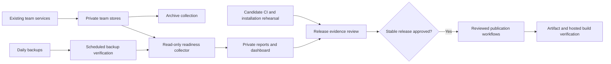

# Stable release readiness

Status: Implemented acceptance monitoring. Stable publication remains a separate decision.

The v0.4.0 preview is published. A preview version does not establish unattended season acceptance.
This workflow collects evidence for live transactions, a weekly cycle, installation consistency, and a stable release.
It preserves draft support and each team's saved action permissions.

## Automatic checks

| Check | Schedule | Evidence |
|---|---|---|
| Team coordinator | Existing 60-second delay after each complete sweep | Authenticated HTTP snapshots, analysis, and transaction reconciliation |
| Readiness collector | Five minutes after its previous run | Fresh health, exact receipts, policy fingerprints, archive progress, week changes, and collection gaps |
| Archive | Existing one-minute timer | Durable team and transaction evidence |
| Backup | Existing daily timer | PostgreSQL, team databases, configuration, and checksums |
| Backup verification | Every hour, including after the daily backup | File hashes, five-team coverage, SQLite integrity, and PostgreSQL dump readability |
| Readiness summary | Updated with each collection | Current sanitized state in the daily summary and dashboard |
| Release rehearsal | Every source CI run and weekly on Sunday at 06:47 UTC | Clean installation, retained-state upgrade, MCP initialization, and existing draft/dashboard/database tests |
| Distribution check | Existing daily 07:17 UTC schedule and update triggers | Public versions, indexed source, and visible tool definitions |

GitHub schedules can start late. Server collection continues independently of GitHub and Codex.
The collector makes no model calls, provider requests, roster changes, or publication requests.



## Acceptance rules

`live_set_lineup` and `live_free_agent_add` require an exact ESPN `EXECUTED` receipt and a matching complete reconciled roster.
The collector checks transaction context, items, authorization time, and the recorded result.
It does not accept `confirmed` text alone.

`live_waiver_claim` also requires an observed pending claim before its executed result.
Pending claims do not establish ownership. FAAB receipts must match the authorized bid.
IR placement and activation have separate live gates. Fixture tests cannot pass these live gates.

`live_rollover` requires each enabled team to advance one verified ESPN week and resume current analysis.
An unresolved claim from an earlier week prevents rollover acceptance at that observation.
`weekly_cycle` requires seven observed days, all-team rollover, and no unhealthy sample or collection gap above 15 minutes.
A change to the configured team set prevents a continuity pass across that change.
The monitor does not infer a full week from elapsed service uptime or backdate observations.
Review documented interruptions before any release decision. The automatic continuity gate remains conservative.

The collector waits up to 21 seconds for a normal coordinator transition before recording an incomplete observation.
It retains 35 days of compact samples in its own database. Unchanged receipts are stored once. Team stores remain read-only.
Proposal collection is limited to 1,000 records per team. Exceeding the limit reports unavailable evidence.
The archive remains the durable source for older evidence.
With `--archive-dsn`, read-only PostgreSQL checks require a recent import and one source checkpoint per enabled team.
Without that option, the report marks archive verification as unknown.

## Review and permissions

The monitor counts observed waiver and IR opportunities for review. These counts are not legal transaction proposals.
Existing policy, ownership, locks, eligibility, roster capacity, and budgets still control each action.
Do not create an unnecessary acquisition, drop, or IR move to complete a test.
Advisory actions require a separate authorized proposal or an explicit bounded policy change.
If no suitable live opportunity exists, report the gate as pending.

The readiness report never grants stable publication permission.
`release_ready` remains false because this monitor does not receive or execute a publication decision.

## Run and inspect

Use a separate private output directory:

```sh
python -m fantasy_football_manager.readiness --manifest "$PRIVATE_LEAGUE_MANIFEST" --output-dir "$PRIVATE_READINESS_DIRECTORY" --systemd
python -m fantasy_football_manager.backup_check --backup-root "$PRIVATE_BACKUP_DIRECTORY" --output "$PRIVATE_READINESS_DIRECTORY/backup-report.json"
fantasy-football-dashboard --manifest "$PRIVATE_LEAGUE_MANIFEST" --readiness-report "$PRIVATE_READINESS_DIRECTORY/report.json" --port 8766
```

Open `http://127.0.0.1:8766/readiness.html` on the host or through an authorized SSH tunnel.
The dashboard exposes only selected gate states. It does not return raw receipts, player identities, credentials, or private paths.
Reports expire after 15 minutes. Missing or stale reports cannot display a current pass.
The normal dashboard's exact approval and submission controls remain available through their existing configuration.

The new systemd templates are in `deployment/systemd/`.
Install their generic paths with the deployment's actual private configuration.
An isolated monitor installation can share existing dependencies without replacing the live coordinator.
Do not publish deployment-specific unit overrides.

## Rehearsals and supplemental evidence

Run `scripts/rehearse_release.py` with a built wheel, an exact previous version, and a private output file.
The script creates fresh and upgraded environments, preserves a fictional snapshot, and compares complete MCP tool definitions.
It initializes all three MCP servers with private configuration removed. Playwright must be absent.
The CI matrix separately preserves browser draft fixtures and dashboard interaction checks.

Run `scripts/rehearse_backup_restore.py` only against an existing empty database with an `ffm_rehearsal_` name.
The current role must own that database. The helper verifies the selected backup before restoring it.
It restores PostgreSQL, validates archive membership, restores SQLite copies, and compares retained state.
It removes the selected rehearsal database afterward. Production databases are not restore targets.
Run this rehearsal again before publication if its evidence is more than seven days old.

Supplemental JSON receipts are private, operator-controlled records. They are not third-party attestations.
All require `schema_version: 1` and an aware `checked_at` timestamp.
The collector reads these exact files from its output directory:

| File | Required evidence |
|---|---|
| `backup-report.json` | The backup verification helper's complete result, less than 36 hours old |
| `restore-report.json` | Full isolated restore, all team databases, six archive tables, and confirmed scratch-database removal |
| `candidate-report.json` | Exact 40-character commit and verified `ci`, `clean_install`, `upgrade`, `draft_regression`, `dashboard_regression`, `docs_current` checks |
| `installation-report.json` | Matching candidate commit and verified `services_match`, `plugins_match`, `mcp_definitions_match` checks |
| `waiver-window-report.json` | Every team key, HTTP rules evidence, actual opening/closing/verification times, and verified terminal results |
| `distribution-build-report.json` | Matching candidate commit and verified GitHub/PyPI artifacts, Registry publication, and Glama build commit |

Do not fabricate these receipts to pass a gate. Retain the underlying command output, hashes, CI links, or provider evidence.
Candidate, restore, and waiver-window receipts expire after seven days. Installation and distribution receipts expire after one day.
GitHub/PyPI version agreement does not establish installed source equality or a hosted Glama build commit.

## Remaining release sequence

1. Collect genuine live waiver, IR, and rollover evidence within saved permissions.
2. Complete and review the seven-day operating record and actual league processing windows.
3. Select one candidate commit and reconcile documentation, installations, and tool definitions against it.
4. Complete the candidate CI, clean-install, upgrade, and isolated-restore rehearsals.
5. Review the exact stable version and publication artifacts.
6. Obtain the separate stable-release decision.
7. Publish through the reviewed workflows.
8. Verify public artifact hashes, Registry metadata, and actual Glama build evidence.

Unavailable future events remain pending. The scheduler does not convert missing evidence into success.
