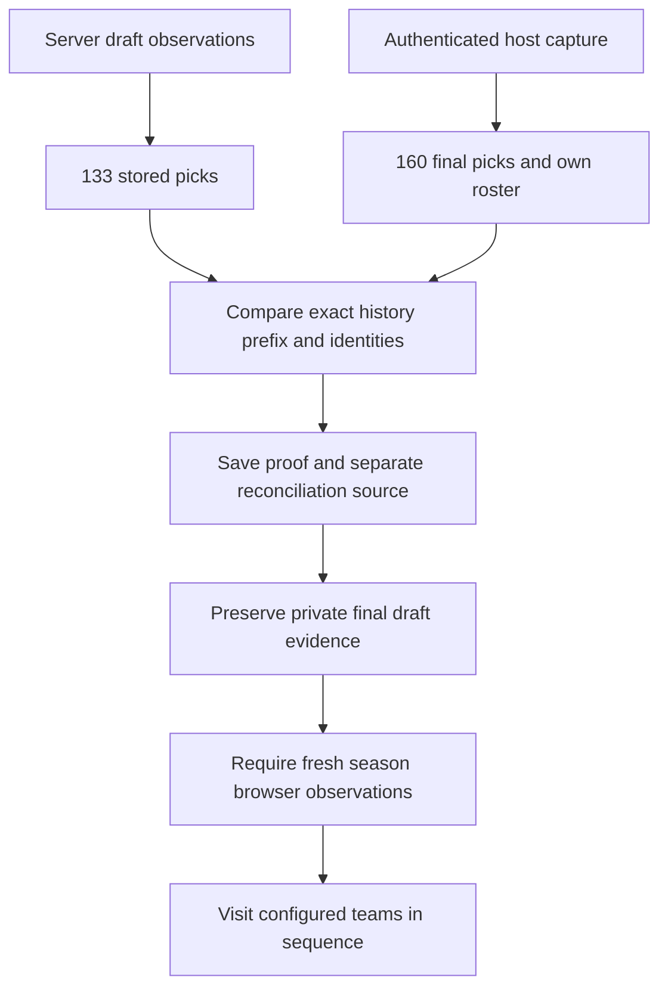

# Third draft acceptance

**Status: Verified draft completion and stored-history reconciliation, with failures and operator interventions.**

The visible draft history contains all 160 selections.
The selected roster contains 16 players: 13 manager-confirmed selections and three operator-confirmed ESPN Autopicks.
The separate host-browser fallback submitted zero `DRAFT` clicks.
This run does not establish unattended draft completion.

## Runtime and scope

The league used a 10-team PPR snake draft with 16 rounds.
The selected team drafted from slot 10.
The executor used installed v0.3.0 with a private bootstrap and operator recovery changes.
It did not use an unchanged released wheel or the final corrected source.
The later source tests provide separate regression evidence.

## Selection results

| Execution source | Overall picks | Count |
|---|---|---|
| Manager submission with confirmed platform observation | 10, 11, 30, 31, 50, 51, 70, 71, 90, 91, 110, 111, 130 | 13 |
| ESPN Autopick, confirmed by the operator | 131, 150, 151 | 3 |
| Separate host-browser fallback `DRAFT` click | None | 0 |

Platform fallback selections are not manager-confirmed submissions.
The fallback labels identify picks 131, 150, and 151 from explicit operator evidence.
Missing receipts alone do not establish Autopick.
The operator submitted no host-browser draft picks and disabled Autopick after roster completion.
The exact cause of the observed Autopick checkbox transition was not recorded.
This trial does not establish a general success rate.

## Failures and interventions

| Stage | Failure or limitation | Intervention and observed result |
|---|---|---|
| Startup | An API team name contained trailing whitespace. The visible roster option did not contain that whitespace. | The operator normalized the private runtime's team-name mapping. Exact team identifiers and roster checks remained in effect. |
| First turn | An initial preflight did not find a visible enabled `DRAFT` button. | The check failed before authorization. A later loop confirmed pick 10. |
| After pick 94 | The normal worker stops after its own roster is complete. It does not wait for every league selection. | The operator restarted with no pending claim and added a private observation tail. The later selector failure stopped execution before that tail could finish. |
| Pick 131 | A D/ST autocomplete regex contained an unescaped slash. Playwright rejected the selector before the player submission. | ESPN Autopick made selection 131. The operator then stopped the worker with no awaiting claim. |
| Final two turns | The fallback handoff did not produce a host-browser submission before the turns expired. | ESPN Autopick made selections 150 and 151. The operator verified both selections. |
| After draft completion | Two server reconnection attempts could not restore the completed draft controls. | The operator reconciled the saved host capture against the stored history. This was a separate evidence import, not a fresh server draft observation. |

One controller can hold a shared browser profile lease at a time.
ESPN also disconnected the separate Chrome draft session while the server held the draft connection.
That second browser could not serve as a simultaneous live standby in this trial.
Operator recovery must account for the current controller and its pending claims.
The fallback handoff in this trial did not establish reliable recovery before the next turn.

## Final history reconciliation

The authenticated host capture contains 160 consecutive, unique selections and all 16 selected-team picks.
Every captured row matched its player name, position, NFL team, and expected snake-order owner.
ESPN season metadata mapped stored NFL team identifiers to the displayed abbreviations.
All 133 picks already stored by the server matched the captured prefix exactly.
The import preserved league rules, player metadata, configuration, and projection observation times.

The final snapshot uses `espn_host_browser_reconciliation` as its source provider.
A private proof binds the imported snapshot to the reviewed capture hashes.
The exact UI observation time was not recorded.
The schema-required timestamp identifies artifact recording time. It does not establish current browser state or live action permission.
The terminal pick value follows from the complete history. It is not a live on-the-clock reading.

The private reconciliation checks passed 22 positive and rejection cases before import.
The final extractor found zero unresolved authorized claims and ten prepared proposals that never received authorization.
Fresh authenticated season observations remain a separate requirement for season actions.



## Measured work and receipt timing

Durable calculation records contain **659 completed calls and 26,360 completed trials**.
Of these calls, 658 produced current results. One completed call was discarded after a stop.
The count sums individual completed calls. It does not use aggregate worker counters or imply independent outcome samples.
More trials do not establish better picks or season results.

All 13 confirmed receipts include authorization and platform observation timestamps.
The observed interval ranged from **1.45 to 3.49 seconds**, with a **2.72-second median**.
This measures authorization to platform observation. It does not measure exact click time, network latency, or total time available on the clock.
The missed turns remain failures regardless of these confirmed-receipt intervals.

## Source regression checks

The current source strips surrounding whitespace from the chosen API team name.
The [waiting-room unit tests](../tests/test_espn_browser.py) exercise an unselected team's trailing whitespace.
The [public draft Chrome fixture](../tests/test_espn_public_draft_integration.py) also includes that mismatch.
These checks retain exact member, team, and roster identity requirements.

The current source escapes slash delimiters in dynamic Playwright regex selectors.
The [D/ST autocomplete Chrome test](../tests/test_browser_integration.py) reproduces the failed selector with a fictional player.
Both `D/ST` and `DST` display variants failed before the fix and passed after it.
The test also verifies that wrong-team and wrong-position suggestions receive zero clicks.
The [browser implementation](../src/fantasy_football_manager/espn_browser.py) contains both fixes.

The complete local suite passed **611 tests**, with **2 skipped**, in **35.63 seconds**.
The run used Windows, Python 3.12.13, and `FFM_BROWSER_TESTS=1`.
It included **17 isolated Chrome cases**: seven draft cases and ten season cases.
The isolated pages use fictional data and intercepted requests.
These tests did not submit changes to a live league.

```powershell
$env:FFM_BROWSER_TESTS = "1"
uv run pytest -q
```

## Final evidence and limits

| Check | Evidence state |
|---|---|
| Visible complete league history | Verified: 160 selections. |
| Selected roster | Verified: 16 players, with execution sources separated above. |
| Stored-history comparison | Verified: all 133 existing picks matched the host capture. The final stored history contains 160 picks. |
| Fresh server draft-room observation after completion | Not established. Both reconnection attempts failed. A separately labeled host-capture import completed reconciliation. |
| Season handoff for this roster | Verified after the v0.3.1 server upgrade. Three exact Week 1 contexts produced fresh browser observations, verified selected-team locks, and zero unresolved claims. |
| Unchanged installed v0.3.0 live execution | Not Tested by this modified runtime. |
| Final corrected source in this live draft | Not Tested by this run. The source fixes passed isolated tests afterward. The separate [fourth draft](FOURTH_DRAFT_ACCEPTANCE.md) records later installed v0.3.1 execution. |
| Unattended completion and automatic fallback recovery | Not established. Operator interventions were required. |

The [compatibility matrix](ESPN_COMPATIBILITY.md) records supported layouts and earlier failures.
The [multi-team acceptance plan](MULTI_TEAM_ACCEPTANCE.md) defines further trials.
Live waivers, drops, trades, and automatic week rollover remain outside the implemented action scope.
Private receipts and captures remain outside the public repository.
This report contains no account, league, team, member, or proposal identifiers.
